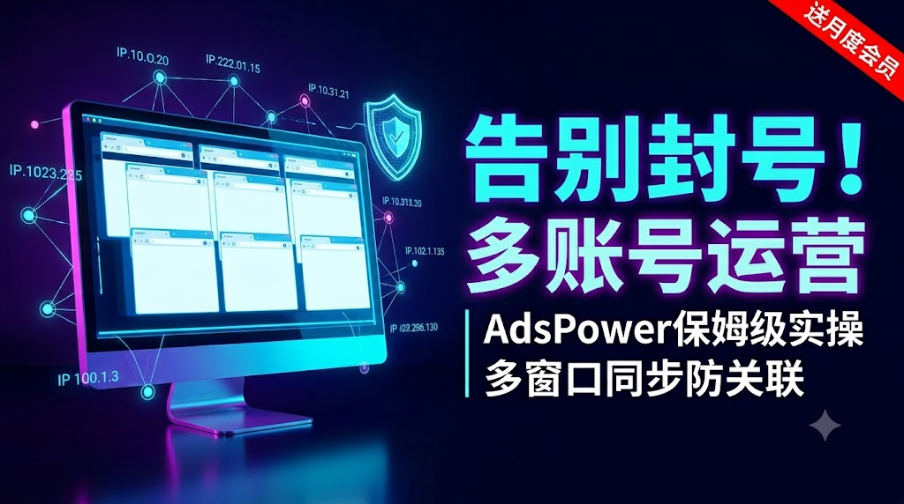

# 🚀 零基础搞定多账号运营！指纹浏览器超详细保姆级教程：从防关联到批量养号 | TikTok矩阵 | AdsPower实操 | 跨境防封

{ .hide-in-post width="300" align=left style="border-radius: 8px; margin-right: 20px; box-shadow: 0 4px 10px rgba(0,0,0,0.1); margin-bottom: 10px;" }

<strong>本期要点：</strong> 基础搞定多账号运营！指纹浏览器超详细保姆级教程！

<!-- more -->

  <iframe src="https://www.youtube.com/embed/TCbDFdgQCVc" style="position: absolute; top: 0; left: 0; width: 100%; height: 100%;" title="YouTube video player" frameborder="0" allow="accelerometer; autoplay; clipboard-write; encrypted-media; gyroscope; picture-in-picture" allowfullscreen></iframe>

---

## 第一步：安装指纹浏览器
* AdsPower指纹浏览器：[官方下载地址][Ads]

## 第二步:准备代理
1.直连中转代理(下方二选一):

* (1)机场节点(多人共用/稳定性差/便宜):[👉主播自用机场][机场推荐表]
* (2)服务器(VPS)自建节点(个人独享/稳定)：[👉主播实测VPS推荐表][VPS推荐表]
* 自建节点搭建教程👉
--8<-- "includes/videos.md:BWG-vps"
--8<-- "includes/videos.md:VPN-JD"

2.静态住宅代理:[👉点击查看详情][静态代理推荐表]

3.账号购买平台:[👉点击查看详情][账号星球]

## 第三步:本地代理软件开启
* 视频演示以V2rayn为例：[V2rayn电脑版下载地址][v2rayn电脑版]

## 第四步:配置指纹浏览器
1.导入代理
2.批量创建环境
3.多窗口同步
4.控制主窗口(批量注册/日常刷视频/...等其他批量任务)

## ⚠️ 免责声明
* 本文内容仅供技术交流，请遵守当地法律法规。

--8<-- "includes/links.md"