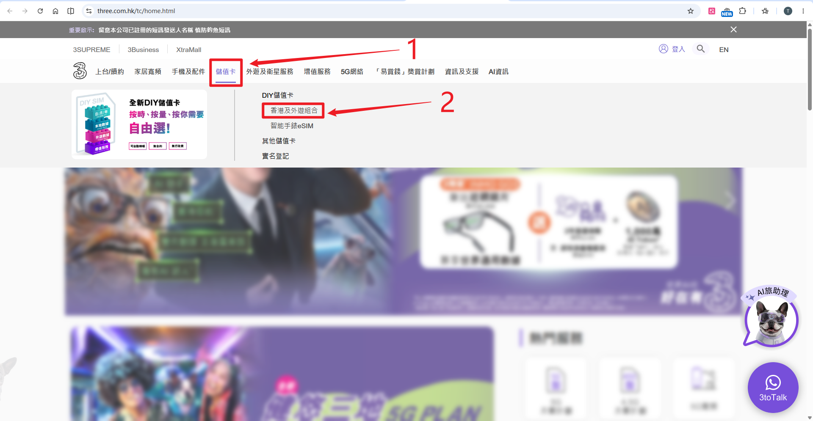
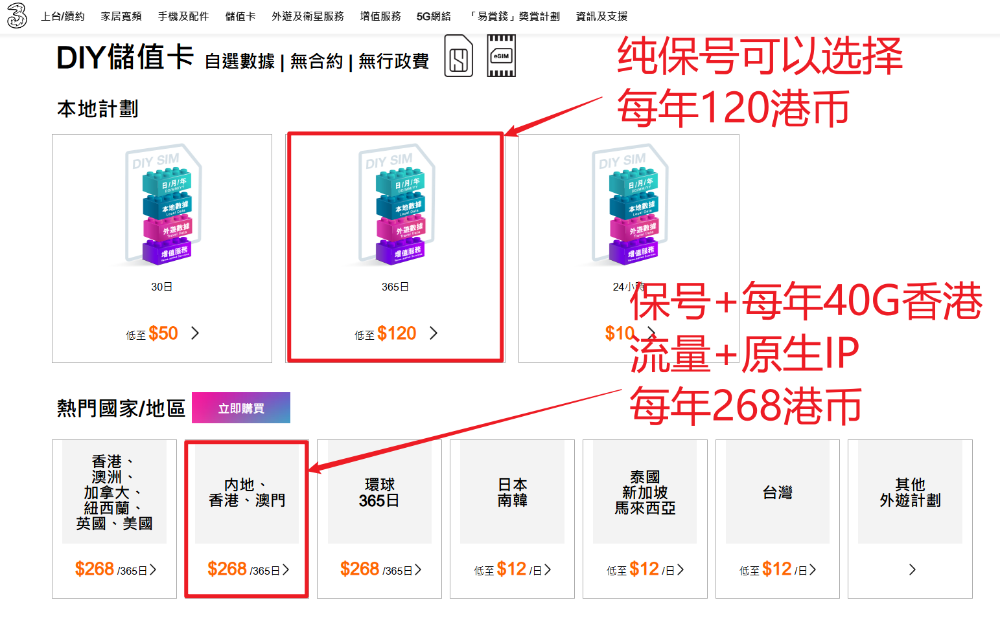
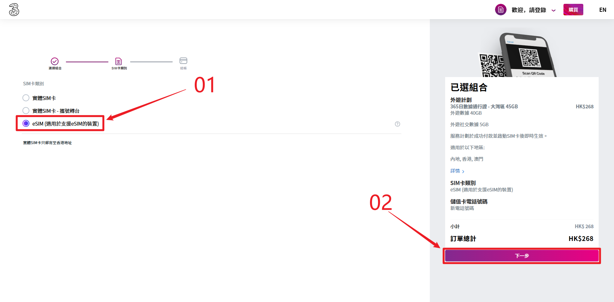
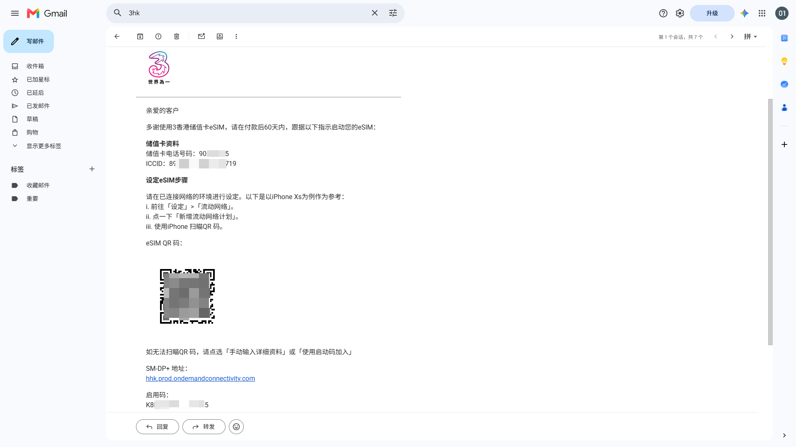
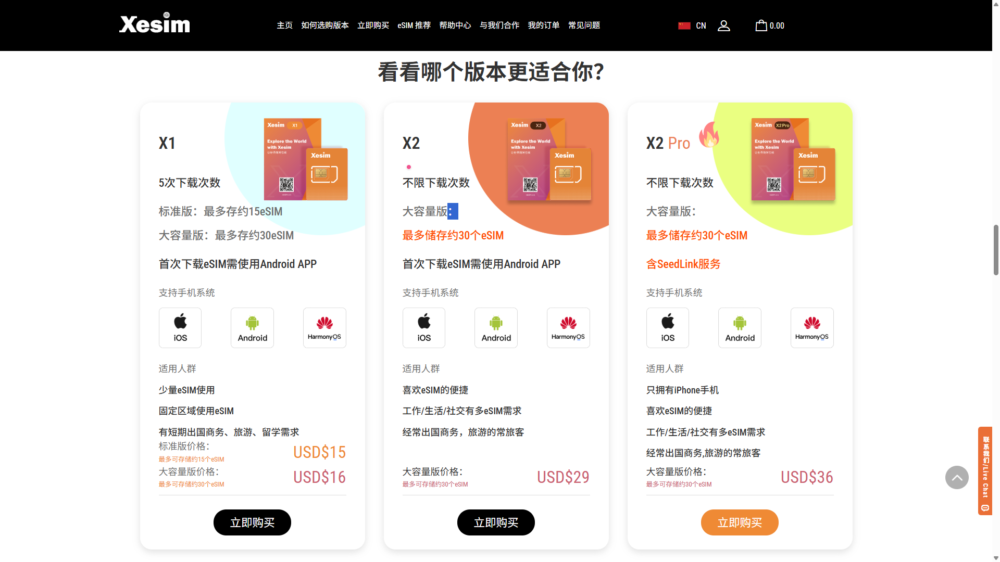
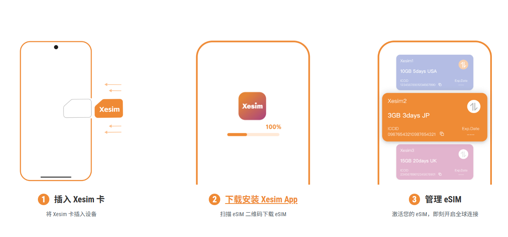
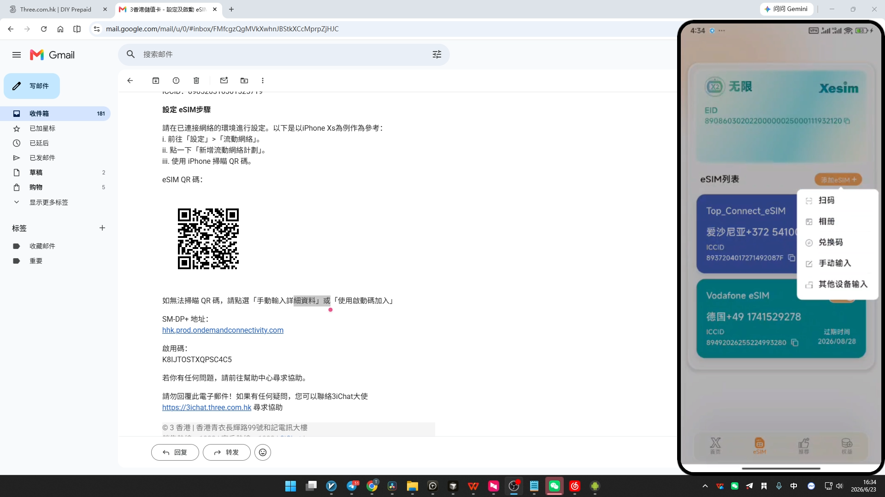
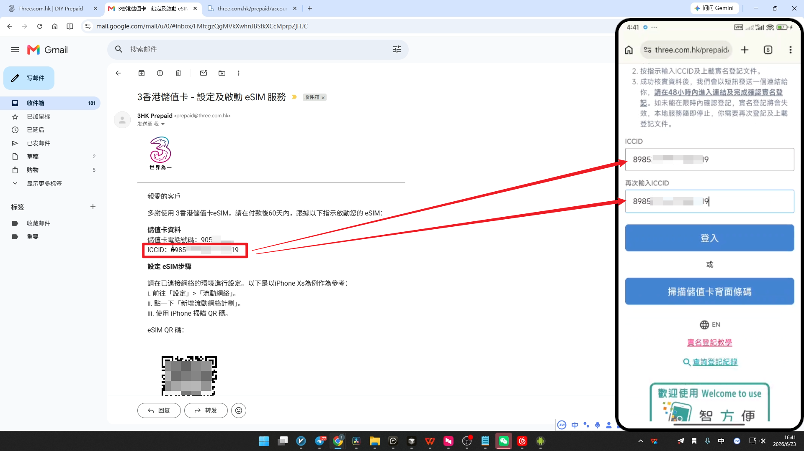
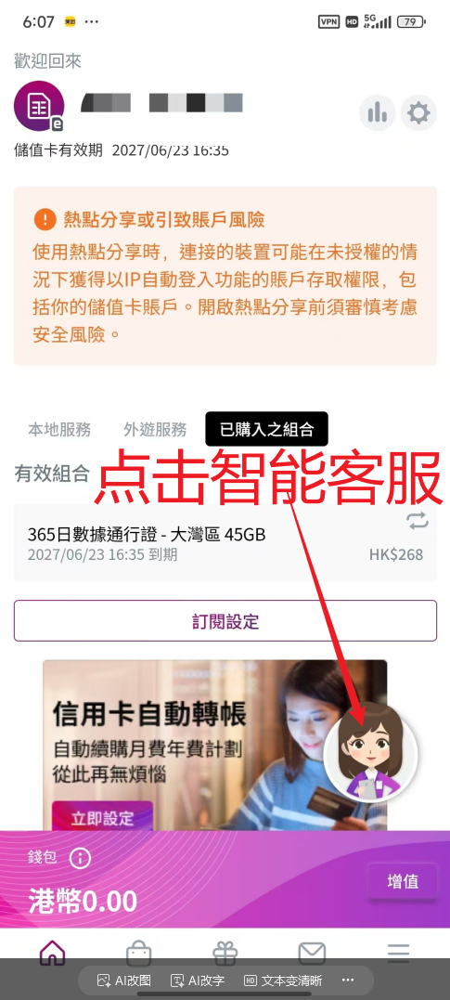
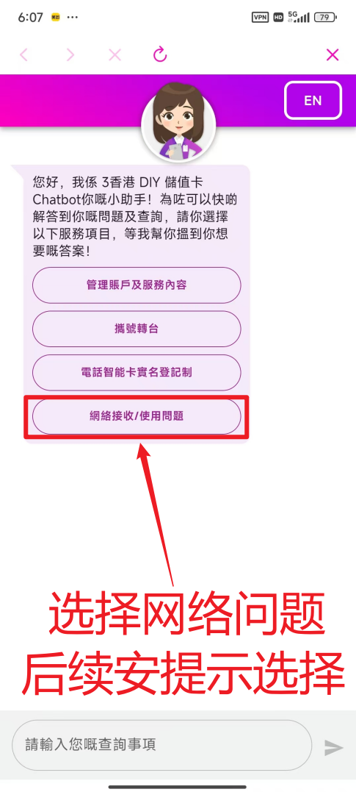

# 🗃️ 3HK eSIM 保号卡完整指南：百元级养一个香港手机号｜3HK DIY / 香港 eSIM / 跨境电商 / 海外注册

{ .hide-in-post width="300" align=left style="border-radius: 8px; margin-right: 20px; box-shadow: 0 4px 10px rgba(0,0,0,0.1); margin-bottom: 10px;" }

<strong>本期要点：</strong> 海外节点总被风控？本期教你自建独享VPN，零成本白嫖纯净住宅IP，彻底告别封号！实操文档与工具链接见下方，早薅早享受！

<!-- more -->

  <iframe src="https://www.youtube.com/embed/cJg5y1hVoRQ" style="position: absolute; top: 0; left: 0; width: 100%; height: 100%;" title="YouTube video player" frameborder="0" allow="accelerometer; autoplay; clipboard-write; encrypted-media; gyroscope; picture-in-picture" allowfullscreen></iframe>

---

## 🔗 视频相关链接
* **3 HK 官方网站：** [点击直达 eSIM 选购页面](https://www.three.com.hk/tc/home.html)
* **Xesim 实体转接卡：** [点击进入官网专属通道][xesim]
* **My3 App 下载：** 请在苹果 App Store 或 Google Play 搜索 `My3` 进行下载。

!!! abstract "如果你是从 YouTube 视频过来的朋友，可以直接点击上方链接获取工具。下方亦附有详细图文教程"
---

## 💡 为什么需要一张 3 HK eSIM？

对于经常折腾海外业务的玩家来说，一张低成本且能长期在国内漫游保号的香港手机卡几乎是刚需。无论是用于绑定各类跨境电商平台，还是为了顺利接收 Paypal（香港）、汇丰银行等离岸银行账户的动态验证码，3 HK（香港和记电讯）推出的这款 DIY 储值卡都是目前值得考虑的方案之一。

---

## 一、官网选购与注册流程

购买过程非常简单，全程可以在线上完成。请按照以下核心步骤进行操作：

### 1. 定位目标套餐（核心决策点）

首先，访问 [3 HK 官方网站](https://www.three.com.hk/tc/home.html)。在首页导航栏进入 **「储值卡」** 专区，选择 **「香港及外游组合」**，向下滚动寻找 **「365日套餐」**。

---

在这里，你会面临两个不同价位的选择，请根据你的核心需求对号入座：

| 方案类型 | 价格 | 核心配置 | 适用场景与核心诉求 | 综合推荐指数 |
| :--- | :--- | :--- | :--- | :--- |
| **方案 A：基础保号 + 轻度备用** | 120 港币/年 | 本地计划（以接码为主） | 仅需收短信，极少使用海外网络 | ⭐⭐⭐ |
| **方案 B：保号 + 原生网络兜底** | 268 港币/年 | 外游计划（中港两地大容量流量）| 节点防失联、高频操作离岸金融账户 | ⭐⭐⭐⭐⭐ |

!!! info "给「极限保号」玩家的特别说明"
    如果你对原生流量**毫无需求**，只想要全网最低成本的“纯保号”，那么 3 HK 的这款方案 A 其实定位略显尴尬。综合体验下来，我更推荐大家直接上方案 B。至于追求极致低成本保号的朋友，我后续会单独出一期“几十块钱极限保号 eSIM”的实操教程，敬请期待！

---

### 2. 为什么原生 IP 如此重要？（高阶适用场景）

很多朋友可能会问，自己已经有了稳定节点，为什么还要多花钱买一张带流量的卡？这就涉及到了高阶的网络安全与防风控玩法：

* **金融类 APP 极速防风控：** 当你登录Paypal(香港)、ZA Bank、中银香港等离岸银行账户，或者进行大额跨境转账时，使用一般的节点极易触发银行的严格风控系统。而切换到 3 HK 的移动网络，你使用的就是纯正的香港原生运营商 IP，金融交易环境极其干净、安全。
* **自建节点失联兜底：** 常在河边走哪有不湿鞋，当你的代理服务器遇到网络波动或需要紧急重置时，这张卡自带的免翻网络就是你的“速效救心丸”。

!!! info "**💡 个人实测感受分享**"
    权衡之下，我自己最终办理的就是 **268 港币/年** 的套餐。它最大的爽点在于**内地和香港两地通用**。平时在国内操作离岸账户、刷海外信息，速度和稳定性都极佳；偶尔去香港办业务也完全不用重新买流量包，真正做到了“一卡在手，两地无忧”。

!!! tip "确认卡片类型"
    无论你最终决定选哪个套餐，在点击进入商品详情页后，请务必再次核对号卡类型是否勾选了 **「eSIM」**，而非实体 SIM 卡。

---

### 3. 邮箱注册与验证
确认套餐无误后进入结账页面。系统会要求你输入一个有效的**电子邮箱地址**。
获取并填入邮箱验证码后，按提示完成账号密码的设置，并勾选同意相关服务条款。

---

### 4. 完成支付与查收
3 HK 对跨境用户的支付极其友好。在支付环节，你可以根据自己的习惯选择合适的支付方式。付款成功后，大约等待 3 到 5 分钟，你的注册邮箱就会收到一封包含 **eSIM 二维码**和激活指南的官方邮件。

!!! warning "重要提醒"
    请务必妥善保存这封带有二维码的邮件！后续无论是在新手机上添加 eSIM，还是进行补卡操作，这个二维码都是极其重要的凭证。

---

## 二、 eSIM 写入实操：打破国行手机的“锁区”限制

现在我们已经成功拿到了 3 HK 官方发来的 eSIM 二维码邮件。接下来，就到了真正将其写入手机的环节。

在这里，我必须先和大家分享一下我曾经踩过的“大坑”，以及最终找到的低成本最优解。

### 1. 海外版/港版手机：直接扫码导入（极简模式）

如果你手里的主力机刚好是原生支持 eSIM 的港版或海外版手机，那么恭喜你，操作非常省事。
你不需要借助任何第三方工具，直接打开手机的**「设置」 -> 「蜂窝网络」 -> 「添加 eSIM」**，使用相机扫描刚才邮件里的二维码，按系统提示一路点击确认，即可写入使用。

*(注：原生支持的机型操作属于系统标准流程，各大品牌略有不同但都非常直观，此处不再赘述。)*

### 2. 国行手机的“尴尬”困境

如果你和我一样，主力机是一台纯正的“国行手机”，直接拿系统去扫刚才的二维码是绝对行不通的。你会遇到以下两层极其严格的限制：

* **物理阉割：** 绝大多数传统的国行手机，在出厂时直接从硬件主板上移除了 eSIM 模块。
* **底层锁区：** 哪怕是近期部分新款国行设备终于加上了 eSIM 功能，它们也是带有“锁区限制”的特供版。系统底层被严格锁死，**仅开放给国内三大运营商使用**，压根无法识别并写入海外运营商（如 3 HK）的配置。

!!! warning "避坑提醒"
    我当时为了保住这个海外号，差点以为必须要去花大价钱买一台外版备用机。这不仅成本极高，而且日常双机携带也非常累赘。千万不要冲动去买备用机！

### 3. 终极解决方案：Xesim 实体转接卡（物理外挂）

折腾了一圈后，我发现了一个极具性价比的方案——也就是我们今天的主角：[Xesim 转接卡(点击跳转官网)][xesim]。

简单来说，这是一张**植入了安全微型芯片的特制实体 SIM 卡**。它的核心工作逻辑是“偷天换日”：

1. **即插即用：** 你只需要把它像普通电话卡一样，插进国行手机传统的物理卡槽里。
2. **打破限制：** 配合其专属的 App 进行读写，它能直接绕过手机硬件和系统底层的锁区限制。
3. **无限烧录：** 通过 App，我们可以把买到的任何海外 eSIM 二维码数据，直接写入这张实体卡的芯片中。

这样一来，咱们的国行手机就瞬间拥有了完整、不设限的全球 eSIM 写入能力！接下来，我就以我自己的这台国行手机为例，给大家实操演示一下，如何将 3 HK 的号码完美装进这张 Xesim 实体卡里。

---

## 三、 实操激活：从写卡到找回信号的“通关全流程”

当我们使用 Xesim 的专属 App（或者外版手机原生设置）扫描邮件里的二维码后，号码配置就会被写入到芯片中。
但是，**写卡成功绝不等于能马上上网！** 接下来，你必须严格按照以下顺序完成后续操作，错一步都会导致你的手机处于“无服务”状态：

### 1. 触发并完成实名登记（极易踩坑）

香港电讯法规要求，电话卡必须实名才能连上基站。但很多人在这里会陷入“死循环”：没实名就没有信号，没信号就收不到实名验证码。

**正确的破解流程如下：**

* **查收实名邮件：** 当你完成上面“扫码写卡”的动作后，3 HK 的系统才会被触发，向你的注册邮箱发送一封包含实名登记入口的邮件。
* **使用 ICC 码验证：** 点击邮件链接进入实名页面，系统默认可能会让你输入手机号收验证码。**千万不要选发短信！** 请手动切换验证方式，输入官方开卡邮件里提供的 **ICCID 码（简称 ICC 码）** 来进行身份验证。

* **提交护照/通行证：** 按照页面提示，拍摄并上传你的个人有效证件（推荐使用护照或港澳通行证）。
* **二次邮件确认（必做）：** 提交资料后，系统会向你的邮箱**再发送一封确认邮件**。你必须点击这封新邮件里的专属链接，整个实名审核才算正式通过。

### 2. 终极排雷：重置国际漫游

实名通过后，如果你发现手机依然死活搜不到信号，不要慌！这通常是因为系统后台的国际漫游设置卡住了。

* **召唤智能客服：** 在连着 WiFi 的情况下，下载并打开 3 HK 的官方客户端（My3 App）。直接点击右下角的 **「AI 助手」**。

---

---

* **发送重置指令：** 在聊天对话框中，依次精准选择以下选项来引导 AI 客服：**「网络接收/使用问题」 ➔ 「网络接收问题」 ➔ 「外游网络接收问题」**。当你走完这个特定路径后，系统后台就会自动为你重启国际漫游权限。

### 3. 飞行模式“唤醒”信号

AI 后台重置完成后，回到手机的系统设置界面，**打开飞行模式，静静等待约 10 秒钟，然后再关闭飞行模式。**

此时，你的手机会强制重新向当地基站发起网络注册请求。稍等片刻，久违的信号栏就会满血复活，同时你也会顺利收到激活成功的欢迎短信！

!!! success "恭喜！顺利通关"
    至此，你拥有了一个属于自己的香港原生手机号！无论是用于跨境电商防风控，还是高频操作离岸金融账户，它都将为你提供极其干净、安全的网络环境。

--8<-- "includes/links.md"