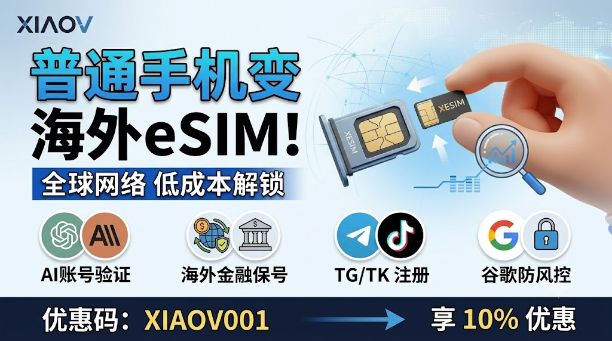
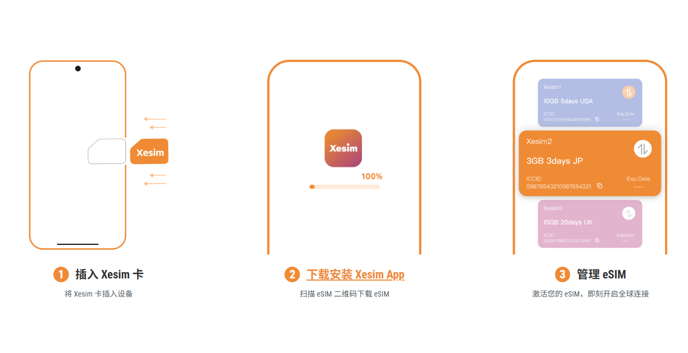
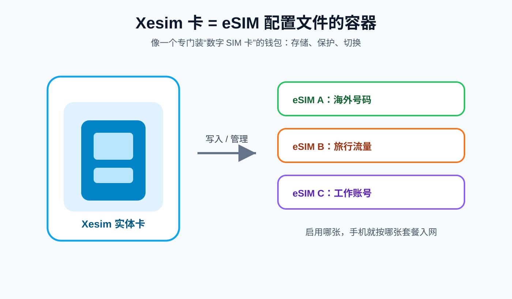
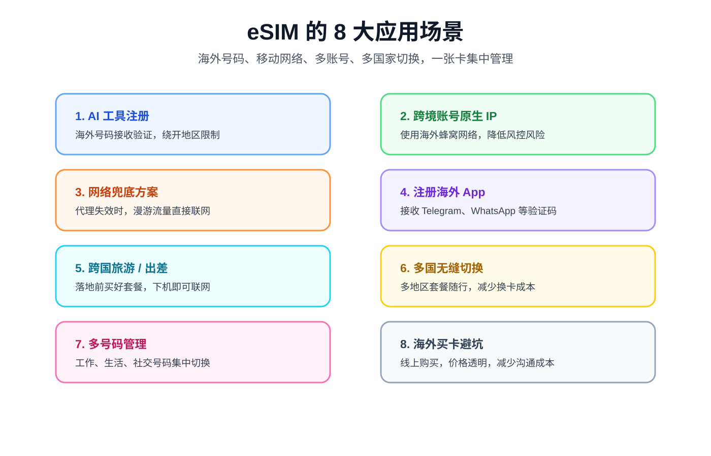
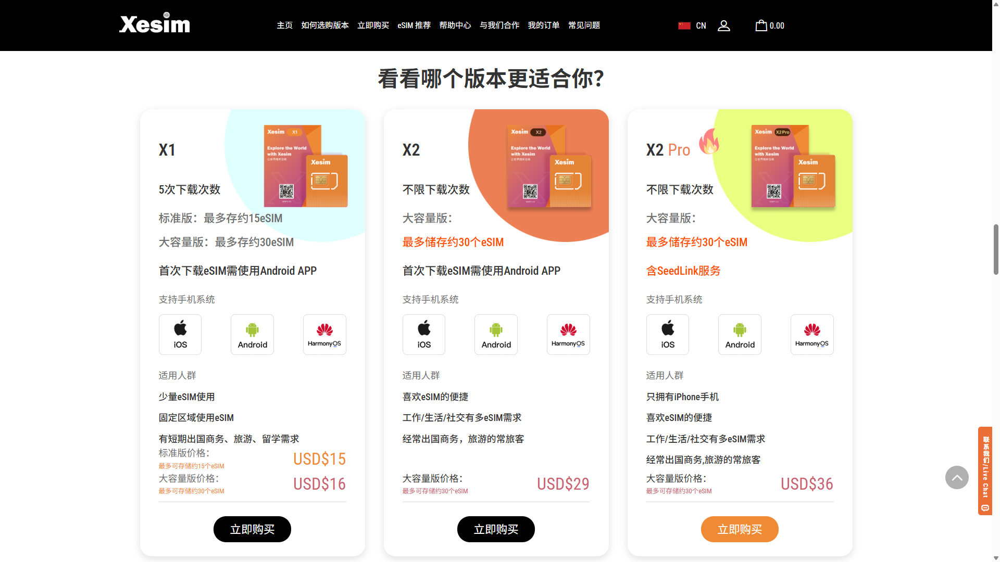
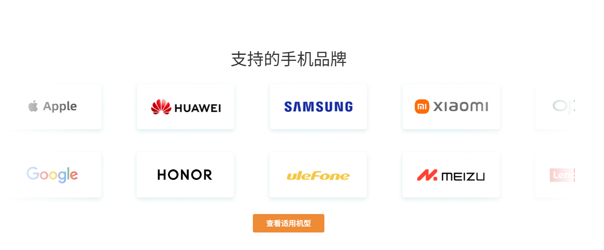

# 📱 国内手机如何免换机开通海外 eSIM？Xesim 保姆级图文教程

{ .hide-in-post width="300" align="left" style="border-radius: 8px; margin-right: 20px; box-shadow: 0 4px 10px rgba(0,0,0,0.1); margin-bottom: 10px;" }

<strong>本期看点：</strong>想要在出国旅游、出差时告别繁琐的换卡和高昂的漫游费？想要使用前沿 AI 工具或注册海外 App 却苦于没有境外号码？eSIM 绝对是完美的解决方案。

<!-- more -->

  <iframe src="https://www.youtube.com/embed/TNpzUcM3j5o" style="position: absolute; top: 0; left: 0; width: 100%; height: 100%;" title="YouTube video player" frameborder="0" allow="accelerometer; autoplay; clipboard-write; encrypted-media; gyroscope; picture-in-picture" allowfullscreen></iframe>

---
## 📺 视频相关链接
1. Xesim官网地址（`优惠码：XIAOV001`）：[点击跳转官网][xesim] 
2. TG交流群：[https://t.me/xiaovchat](https://t.me/xiaovchat) 
3. eSIM推荐：[点击查看详情]()

{ style="display:block; width:100%; max-width: 920px; margin: 20px auto 28px; border-radius: 12px; box-shadow: 0 6px 18px rgba(15,23,42,0.10);" }

  
<strong>阅读提示：</strong>上方是视频里提到的相关链接和资料，适合从视频跳转来的朋友快速查找、复制。

  
从下面开始是完整图文教程，适合想系统了解 Xesim / eSIM 的朋友按步骤阅读。

## 一、 什么是 Xesim 解决方案？

简单来说，**Xesim 卡是一个“eSIM 容器”**。

你可以把它理解为一个专门装银行卡的“钱包”。钱包本身没有钱，但你可以往里面放很多张银行卡；你要用哪张卡支付，就启用哪张。

* **它的作用**：用来存储和保护 eSIM 配置文件，让本身不支持（或被阉割了）海外 eSIM 功能的手机，拥有读取和使用海外 eSIM 的能力。

* **使用体验**：当 eSIM 下载到 Xesim 卡并启用后，它就和普通的运营商实体 SIM 卡一样。能否入网、打电话、发短信、使用流量，完全取决于你购买的 eSIM 套餐本身。

{ style="display:block; width:100%; max-width: 920px; margin: 24px auto; border-radius: 12px; box-shadow: 0 6px 18px rgba(15,23,42,0.10);" }

## 二、 eSIM 的 8 大神仙应用场景

如果你还在犹豫是否需要 eSIM，看看以下几个场景是否击中你的痛点：

{ style="display:block; width:100%; max-width: 920px; margin: 20px auto 28px; border-radius: 12px; box-shadow: 0 6px 18px rgba(15,23,42,0.10);" }

1. **前沿 AI 工具必备（重点）**：现在像 Claude、OpenAI (ChatGPT) 等桌面端 AI 应用，注册和使用时都强制要求绑定手机号。**注意：它们都不支持大陆和香港的手机号！** 此时通过 eSIM 购买一个海外号码套餐，就能轻松解决 AI 工具的注册拦截问题。

2. **跨境出海账号的“原生 IP”利器**：带有配套蜂窝流量的海外 eSIM，能为你提供纯净、高质量的海外**原生移动 IP**。在运营跨境电商店铺（如 TikTok Shop）或孵化海外社媒账号时，直接使用这张卡的流量，完全无需费时费力去寻找或使用容易被风控的“伪装住宅 IP”，极大地提高了各平台注册和稳定运营的成功率。

3. **海外网络访问的“终极兜底方案”**：当遇到特殊网络环境，所有常规代理或节点都失效断连时，eSIM 的海外漫游流量就是你最大的底牌。无需任何复杂设置，打开数据漫游就能随时随地直接连接世界。

4. **注册主流海外 App**：玩转海外网络必备！使用 eSIM 的海外号码，可以直接无障碍接收 **Telegram (电报)、WhatsApp、谷歌账号、TikTok (TK)、Facebook** 等海外平台的注册验证码。

5. **跨国旅游/出差**：落地前就能纯线上买好当地的流量或通话套餐，下机直接连网，再也不用满机场找营业厅排队换卡，省时又省心。

6. **多国无缝切换**：eSIM 支持多地区套餐，跨国旅行或出差时无需频繁拔插换卡，网络自动切换到当地服务。

7. **多号码极简管理**：一张卡内可保存多个号码，一键切换。不用每天带多部手机，告别“双枪将”烦恼。

8. **避坑神器**：在人生地不熟的海外，找卖卡的地方费时间又怕被坑，eSIM 纯线上操作，明码标价，是不二选择。

## 三、 Xesim 选型指南：X1 / X2 / X2 Pro 怎么选？

Xesim 目前有 3 种型号，请务必根据你**手头现有的设备**进行对号入座，选错可能会导致无法写入数据：

| 型号 | 适用人群 | 特点与购买建议 | 
| ----- | ----- | ----- | 
| **X2 Pro** | **只有苹果 iPhone 的用户** | **强烈推荐**。因为苹果不支持 SeedLink 服务，买这款不需要借助安卓手机，可直接在 iPhone 上完成 eSIM 信息的下载、写入和管理。 | 
| **X2** | **手头有安卓手机的用户** | **推荐购买**。性价比高。**注意**：如果你想把卡用在 iPhone 上，必须先找一台安卓手机把 eSIM 写入 Xesim 卡中，写好后才能拔下来插回 iPhone 使用。 | 
| **X1** | 不推荐 | 售价 15 美元，但最多只能下载写入 5 次 eSIM，稍微尝试一下就满了，极不划算。 | 

{ style="display:block; width:100%; max-width: 920px; margin: 20px auto 28px; border-radius: 12px; box-shadow: 0 6px 18px rgba(15,23,42,0.10);" }

## 四、 购买前必看：设备兼容性检测

在下单之前，请务必确认你的手机是否支持 Xesim 产品：

1. **官网查询**：直接去 Xesim 官网查看支持的手机品牌和型号列表。

2. **App 自动检测（推荐）**：

   * 在手机上下载并打开 **Xesim App**。
   * 打开后会自动检测你的设备是否兼容。
   * 点击右上角【设置】 -> 【设备信息】。
   * 查看最上方的“支持卡槽”信息（例如显示 `SIM1`，就代表后续你必须把 Xesim 卡插在卡槽 1 中，才可以对 eSIM 信息进行写入和管理）。

{ style="display:block; width:100%; max-width: 920px; margin: 20px auto 28px; border-radius: 12px; box-shadow: 0 6px 18px rgba(15,23,42,0.10);" }

## 五、 专属购卡福利与发货

确认手机兼容并选好型号后，就可以在官网下单了：

* **账号注册**：在登录界面，如果没有账号，点击下方的“从这里开始”进行注册。

* **专属优惠**：在付款之前，记得在优惠券代码处输入 **`XIAOV001`**，即可获得 **10% 的粉丝专属折扣**（优惠码也可以在视频简介中复制粘贴）。

* **物流状态**：付款成功后，在账号的订单中心即可追踪物流。国内发货速度还是比较快的，海外地区物流时间相对会长一些。

---

**总结**：别再为出国漫游和注册海外账号烦恼了！不用换手机，一张转接卡就能让你的旧设备秒变全球通。在线购买、无需换卡、轻松搞定 AI 账号、跨境运营和网络兜底！

--8<-- "includes/links.md"
