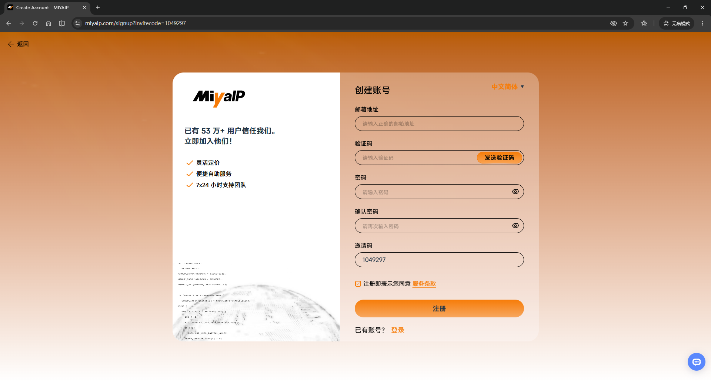
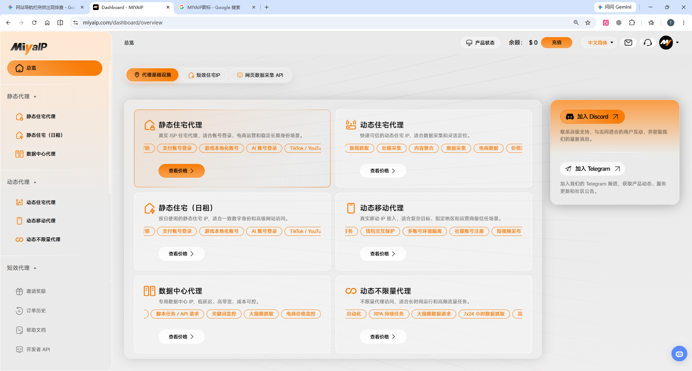
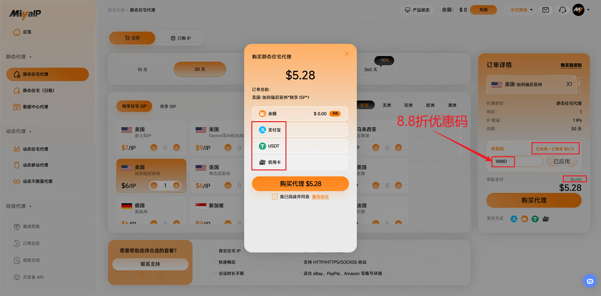
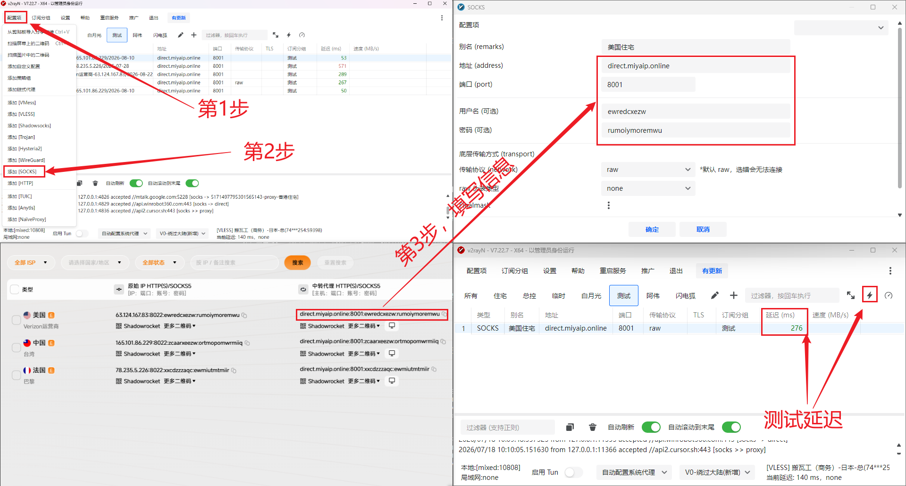
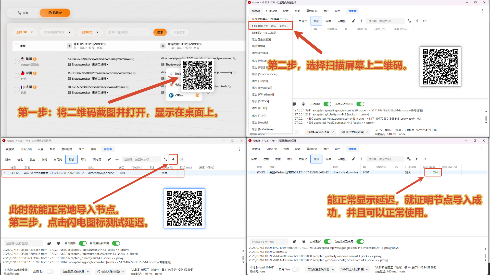
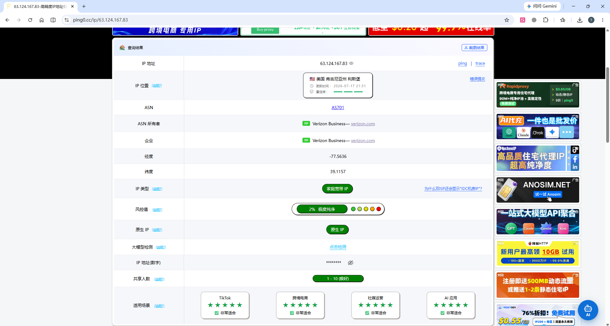
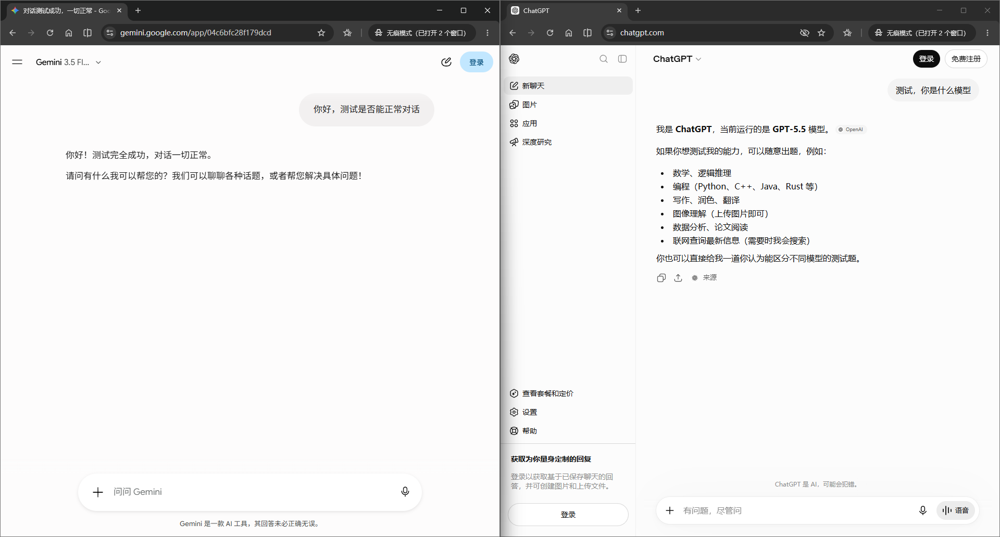
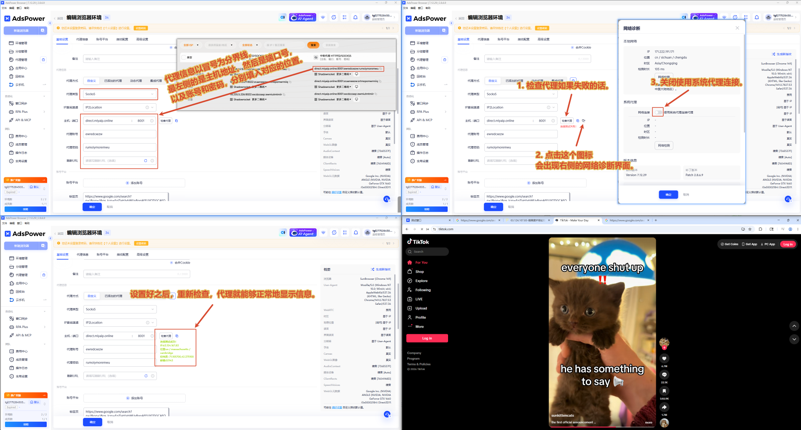

# 🏠 可以直连的静态住宅代理：无需机场、无需自建中转｜IP检测、测速与指纹浏览器实测

{ .hide-in-post width="300" align="left" style="border-radius: 8px; margin-right: 20px; box-shadow: 0 4px 10px rgba(0,0,0,0.1); margin-bottom: 10px;" }

<strong>本期看点：</strong>实测 MIYAIP 静态住宅代理，从购买、导入 V2ray 和指纹浏览器，到 IP 质量、带宽、4K 视频及 AI 网站测试，分享配置技巧与注意事项，适合跨境新手参考。

<!-- more -->

  <iframe src="https://www.youtube.com/embed/Pms77RmHNaU" style="position: absolute; top: 0; left: 0; width: 100%; height: 100%;" title="YouTube video player" frameborder="0" allow="accelerometer; autoplay; clipboard-write; encrypted-media; gyroscope; picture-in-picture" allowfullscreen></iframe>

---

## 📺 视频相关链接
1. 可以直连的静态住宅代理(MIYAIP 官网地址)【`优惠码：V88D`】：[点击跳转][miyaip] 
2. 住宅代理推荐文档：[点击查看详情][静态代理推荐表]
3. Adspower下载地址：[点击跳转][Ads]
4. V2rayN（电脑版）下载地址：[点击跳转][v2rayn电脑版]
5. V2rayN（手机）下载地址：[点击跳转][v2rayng安卓版]
6. TG交流群：[https://t.me/xiaovchat](https://t.me/xiaovchat)

---

!!! abstract "上方是视频相关链接。下方是详细图文教程！"
    

    👇 完整图文教程 👇
    

最近我发现了一款非常适合新手的静态住宅代理——**MIYAIP**。

传统的跨境网络配置需要“先买机场/服务器解决基础连通 -> 再买住宅 IP -> 最后配置链式代理”，步骤繁琐极易出错。而 MIYAIP 最大的优势就是**自带中转，开箱即用**。无需自己搭建服务器，拿到节点信息后直接导入 V2ray 或指纹浏览器即可上网，极大降低了新手的学习和试错成本。

## 一、注册购买与优惠

首先，我们打开 MIYAIP 的官网。点击右上角的注册按钮，完成账号注册并登录，即可进入管理后台。

在左侧导航栏，可以看到除了静态住宅代理外，还有动态住宅、移动代理等选项。本篇教程我们主要聚焦**静态住宅**。

切换到“定价”页面，在下方选择你需要购买的 IP 归属地。

**💡 重点提示：** 在折扣码输入框中，输入专属折扣码 **`V88D`** 并点击确定，即可享受 **88折** 优惠！支付方式支持支付宝、USDT 或信用卡，非常方便。

购买成功后，就可以在“已购 IP”列表中查看你的代理信息了。

## 二、导入与配置节点

在已购列表中，中间显示的是原始 IP 信息，右侧则是**商家已经配置好的中转代理信息**。一般情况下，我们直接使用右侧的中转代理信息即可。导入代理软件（以 V2ray 为例）通常有两种方法：

### 方法一：手动添加节点

1. 打开 V2ray，点击左上角的“配置”或“服务器”项，选择“添加 Socks 服务器”。
2. 自定义一个节点名称。
3. 对照网页上的节点信息（通常以冒号分隔）：
   * 将第一段**地址**复制粘贴到主机的 IP/域名地址栏。
   * 将第二段**端口号**（如 8001）填入端口栏。
   * 将第三段和第四段分别作为**用户名**和**密码**，复制粘贴到对应位置。

添加完成后，选中该节点测试一下延迟。如果能正常显示延迟数字，说明添加成功。

### 方法二：扫码快捷导入

如果觉得手动输入太麻烦，MIYAIP 也提供了快捷导入功能，支持小火箭（Shadowrocket）、V2ray、Nekobox 等主流工具。

将鼠标悬停在“更多二维码”的下箭头处，选择“V2ray”。

1. **手机端 V2ray**：直接用软件扫描屏幕上的二维码即可导入。
2. **电脑端 V2ray**：先将二维码截图并打开图片，然后在 V2ray 中点击“扫描屏幕上的二维码”选项，即可一键导入节点。

## 三、IP质量与网速实测

为了给大家一个直观的感受，我从多个维度对购买的这条 IP 进行了测试。

### 1. IP纯净度检测

我先后使用了 `ping0.cc` 和 `ippure.com` 两个网站进行交叉验证。

检测结果中规中矩。坦白说，在 6 到 11 美元这个价位区间里，我们很难买到那种绝对纯净的真实家庭住宅宽带 IP，市面上同价位的产品大多属于伪装的住宅 IP。

在这个价格区间内，MIYAIP 提供了一个原生、且风控值和共享人数相对较好的静态 IP，加上它自带中转，直接省下了我们额外购买机场或自建中转节点的费用，性价比和新手友好度非常高。

### 2. 流媒体速度测试

打开 YouTube，随机搜索并播放一部 4K 高清视频，打开“详细统计信息”。可以看到视频能够非常流畅地在 4K 画质下播放，且缓冲时间表现健康，没有卡顿感。

### 3. AI工具访问测试

针对大家常用的 AI 生产力工具，我也进行了测试：

* **ChatGPT**：官网秒开，对话框输入内容响应迅速，无网络报错。
* **Gemini**：同样可以正常打开并流畅对话。

## 四、指纹浏览器配置

如果你从事跨境电商或社媒运营，通常会搭配指纹浏览器使用。这里以 AdsPower 为例：

1. 打开 AdsPower，点击“新建浏览器”，填写名称。
2. 代理类型选择 **Socks5**。
3. 按照前面手动添加的方法，依次将域名填入主机地址、填写端口号，并复制粘贴账号和密码。
4. 点击“检查代理”。

**⚠️ 防坑提示：**
如果在 AdsPower 中点击检查代理显示失败，请点击右侧的小图标，**一定要把“使用系统代理连接”的功能关掉！** 因为我们的节点已经自带中转了，开启系统代理反而会引起网络冲突。

关闭后重新检查，正常显示 IP 地址即可点击确定。随后打开浏览器窗口验证 IP，并打开 TikTok 刷视频，实测非常流畅。

## 评测总结

MIYAIP 这款静态住宅代理最大的优势在于“开箱即用”，将住宅 IP 和中转线路打包成了一个完整的产品。如果你正在做跨境业务，需要一个固定的海外网络环境，又不想花费大量精力研究复杂的线路配置，非常推荐先买一个月测试一下。

*(注：每个地区、每条 IP 的实际表现可能存在差异，本文测试结果仅代表当前抽样的 IP 表现，请根据自身实际业务和合规用途进行选择。)*

---

🔐 对加密货币感兴趣的朋友,可以关注下大白课堂[(https://dabaiketang.com/)](https://dabaiketang.com/)
大白课堂创建于 2022 年，长期专注于[加密货币](https://dabaiketang.com/what-is-cryptocurrency-beginners-guide-2026/)交易所注册教程、平台使用攻略、手续费优惠说明和返佣协助服务，是[币安](https://dabaiketang.com/binance-registration-kyc-guide/)、[Bitget](https://dabaiketang.com/bitget-referral-code-dabai50-60-percent-fee-rebate-2026/)、[Bybit](https://dabaiketang.com/bybit-kyc/)、GATE 等多家头部交易平台的长期战略合作伙伴，也是 YouTube、X 等平台华语区的头部创作者。

---

!!! Warning "**免责声明**"
    本文档及相关教程内容仅供计算机网络技术交流与学习测试使用。请务必严格遵守您所在国家或地区的法律法规，切勿用于任何非法用途。

--8<-- "includes/links.md"