# 💷 港币跨境回国，Starryblu 和 Wise 谁损耗更低？真实测试来了！

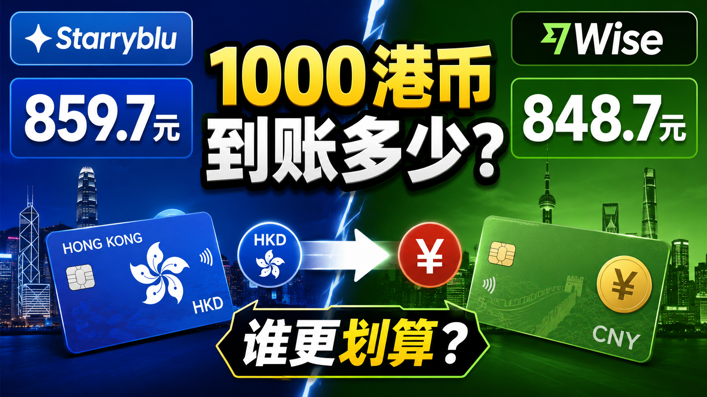{ .hide-in-post width="300" align="left" style="border-radius: 8px; margin-right: 20px; box-shadow: 0 4px 10px rgba(0,0,0,0.1); margin-bottom: 10px;" }

<p class="hide-in-post"><strong>本期看点：</strong>想要在出国旅游、出差时告别繁琐的换卡和高昂的漫游费？想要使用前沿 AI 工具或注册海外 App 却苦于没有境外号码？eSIM 绝对是完美的解决方案。</p>

<div style="clear: both;" class="hide-in-post"></div>

<!-- more -->

<style>
  /* 隐藏封面和摘要 */
  .hide-in-post { display: none !important; }
  /* 选填：给大标题上方加点间距，避免和挪下来的视频贴得太紧 */
  h1 { margin-top: 25px !important; }
</style>

<div id="top-video" style="position: relative; padding-bottom: 56.25%; height: 0; overflow: hidden; max-width: 100%; border-radius: 8px; margin-bottom: 20px; box-shadow: 0 4px 10px rgba(0,0,0,0.1);">
  <iframe src="https://www.youtube.com/embed/Hl3R4-iUwoM" style="position: absolute; top: 0; left: 0; width: 100%; height: 100%;" title="YouTube video player" frameborder="0" allow="accelerometer; autoplay; clipboard-write; encrypted-media; gyroscope; picture-in-picture" allowfullscreen></iframe>
</div>

<script>
  (function(){
    var video = document.getElementById('top-video');
    var h1 = document.querySelector('h1'); // 抓取文档生成的第一个大标题
    if(video && h1) {
      h1.parentNode.insertBefore(video, h1); // 把视频节点插入到大标题前面
    }
  })();
</script>


---

## 📺 视频相关链接
1. Starryblu官网地址【`邀请码：MHQK00U`】：[点击跳转][starryblu] 
2. Starryblu实体卡申请【申请表】：[点击跳转](https://lcnwuorvt317.feishu.cn/share/base/form/shrcn84lQIubn5rh5hcHj41Fp1g)
3. Starryblu实体卡申请【查询表】：[点击跳转](https://lcnwuorvt317.feishu.cn/base/IALgbI5LqaC53cs699WcAhYhnde?table=tblSUMQndL0OUW7I&view=vewn6rdWhg)
3. TG交流群：[https://t.me/xiaovchat](https://t.me/xiaovchat)


!!! abstract "上方是视频中用到的网址。下方亦附有详细图文教程"


---
## 注册前需要准备什么？

- 本人有效护照原件；
- 可以正常接收短信的手机号码；
- 本人居民身份证正反面；
- 光线充足、网络稳定的拍摄环境。

## 第一步：下载 Starryblu App

可以通过下面的官方网站下载 Starryblu：

[点击打开 Starryblu 官方下载页面](https://sg.starryblu.com/x/1q0s0NQv)

也可以在手机自带的应用商城中搜索 **Starryblu**：

- iPhone 用户：在 App Store 搜索 `Starryblu`；
- 安卓用户：在手机应用商城搜索 `Starryblu`。

<div class="grid" markdown>

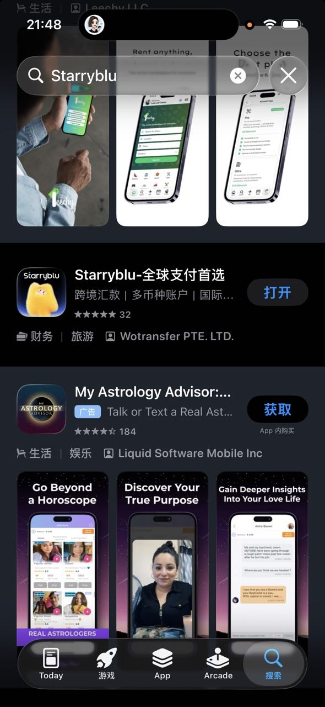

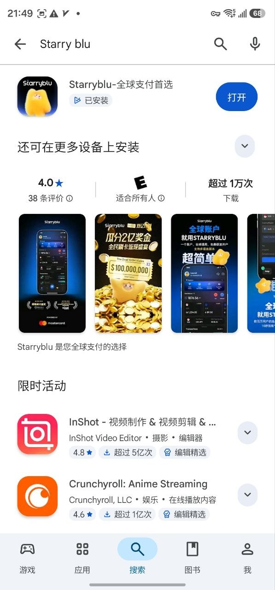

</div>


## 第二步：选择居住地区并创建账号

打开 App 并进入注册流程后，在“居住国家或地区”页面选择 **中国**，然后点击“下一步”。

进入账号设置页面后，依次完成以下操作：

1. 自定义 Starryblu ID；
2. 设置登录密码；
3. 再次输入登录密码；
4. 选择手机区号 `+86`；
5. 输入本人手机号码；
6. 点击“发送验证码”；
7. 输入收到的短信验证码。

如果需要参加对应的新用户活动，请打开“推荐码”开关，并输入：

```text
MHQK00U
```

确认全部信息无误后，点击“确认”。

<div class="grid" markdown>

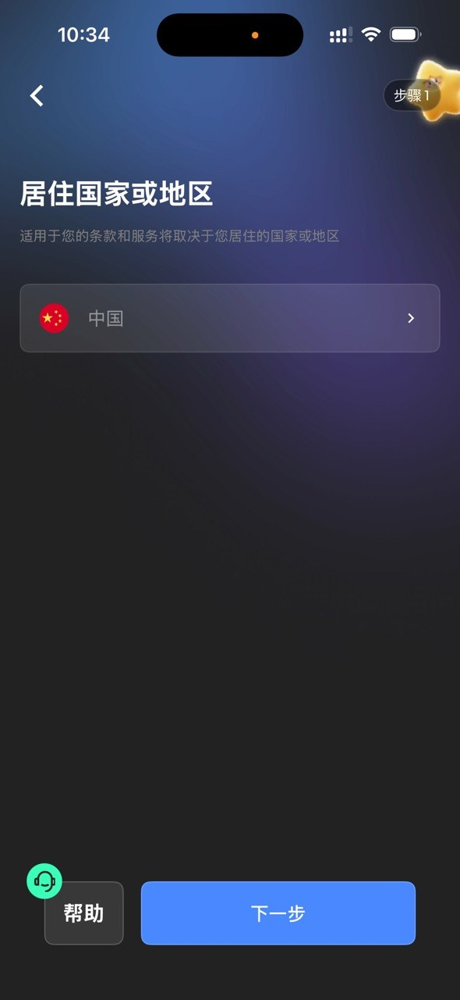

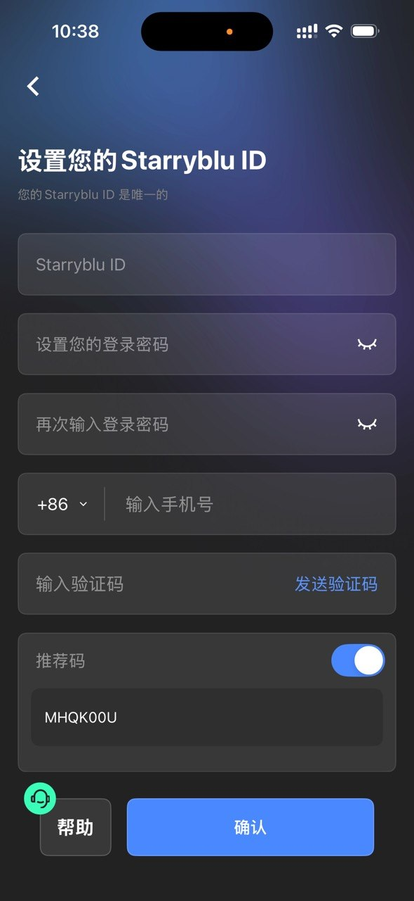

</div>

!!! tip "新用户推荐码"

    注册时可以填写推荐码：**MHQK00U**

    按当前活动说明，新用户可以额外获得 **10 新币消费券**，合计 **20 新币消费券**。具体领取条件、到账方式和有效期，请以 App 内的活动页面为准。
    如果需要提前申请虚拟卡号，可以在注册完成后，将注册手机号或账号ID填写在申请表格中，等待工作人员添加白名单。

    Starryblu实体卡申请【申请表】:[点击跳转](https://lcnwuorvt317.feishu.cn/share/base/form/shrcn84lQIubn5rh5hcHj41Fp1g)

    Starryblu实体卡申请【查询表】:[点击跳转](https://lcnwuorvt317.feishu.cn/base/IALgbI5LqaC53cs699WcAhYhnde?table=tblSUMQndL0OUW7I&view=vewn6rdWhg)


## 第三步：选择护照并拍摄资料页

进入“证件信息”页面后，选择 **中国护照**。

本流程的身份认证需要使用本人有效护照，不能只使用身份证完成申请。

选择证件类型后，按照页面示例拍摄护照资料页。提交前请确认：

- 护照四周边框完整；
- 姓名、证件号码和照片清晰可见；
- 机器可读区没有被遮挡；
- 画面没有模糊、反光或强烈阴影；
- 图片没有被裁切。

<div class="grid" markdown>

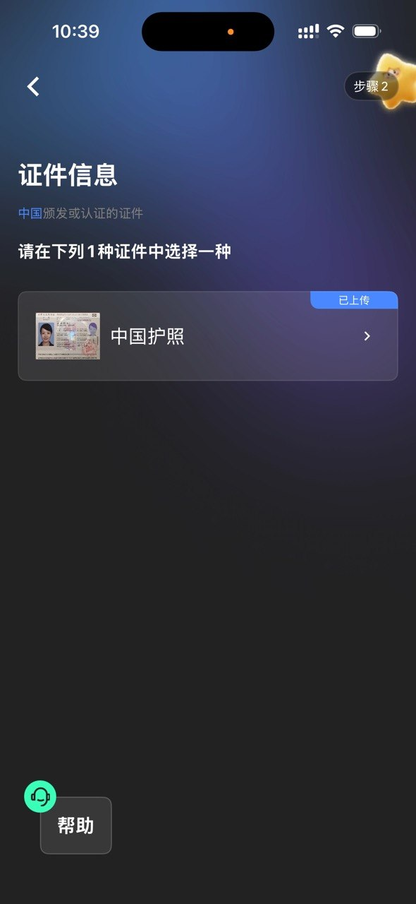

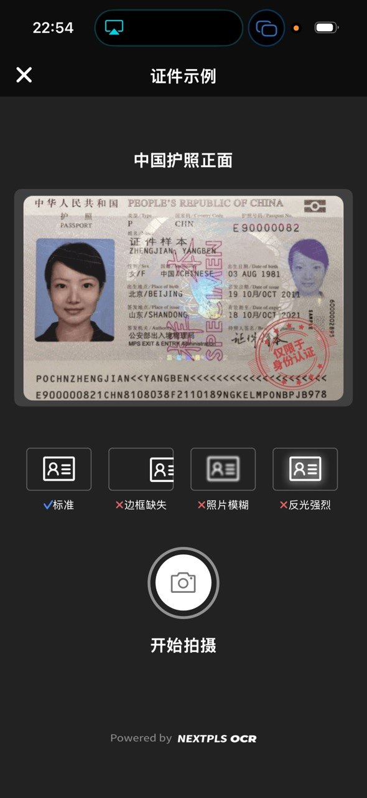

</div>

!!! danger "不要选错证件"

    身份认证环节使用的是护照。居民身份证需要在后面的“地址证明”环节上传，不能在这里代替护照。

如果第一次识别失败，可以调整环境光线、擦拭手机镜头，并将护照平放后重新拍摄。

## 第四步：完成人脸识别并核对身份信息

护照识别完成后，系统会进入人脸识别页面。

将面部放在屏幕提示框内，并按照页面指引完成相应动作，直到系统显示识别成功。

人脸识别完成后，系统会根据护照识别结果自动填写部分个人信息。请逐项核对：

- 姓；
- 名；
- 性别；
- 出生日期；
- 国籍；
- 出生国家或地区；
- 职业。

确认所有信息准确后，点击“下一步”。

<div class="grid" markdown>

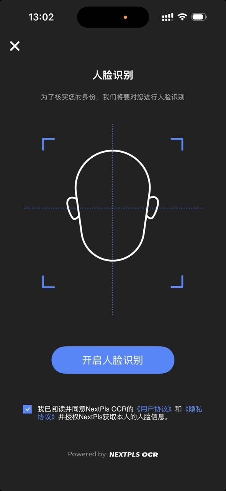

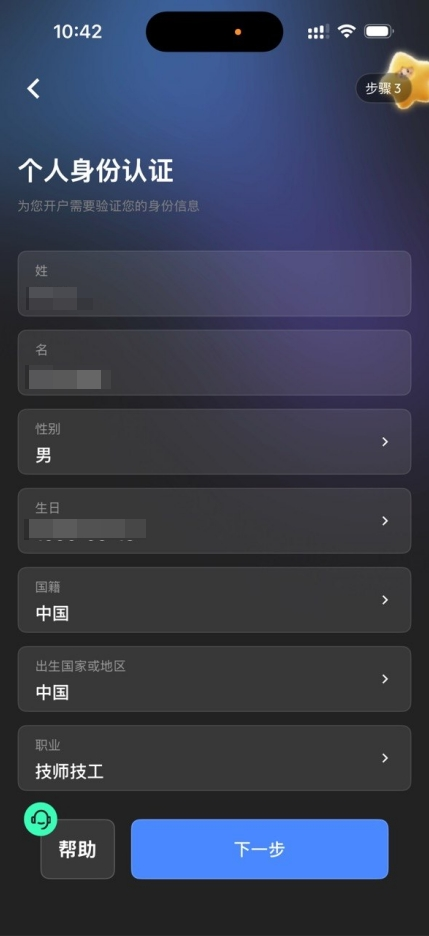

</div>

!!! tip "提高人脸识别成功率"

    请摘下口罩、帽子和深色眼镜，避免逆光，保持镜头清洁，并确保网络连接稳定。

!!! warning "姓名必须与护照一致"

    英文姓名、出生日期和国籍等信息必须与护照资料页完全一致。如果系统识别有误，请先修改正确，再进入下一步。

## 第五步：填写居住地址并上传地址证明

进入“地址信息”页面后，按照真实居住地址依次填写：

1. 省、自治区或直辖市；
2. 市或自治州；
3. 区、街道、镇或乡；
4. 详细地址；
5. 邮政编码。

地址应真实、完整，并尽量与身份证或其他证明材料上的信息保持一致。

填写完成后，点击“地址证明”旁边的“请上传”。

进入地址证明页面后，在证明类型中选择：

**中华人民共和国居民身份证**

然后分别上传身份证正面和反面。上传后请确认：

- 身份证正反面没有传错；
- 图片方向正确；
- 证件四角完整；
- 姓名、地址和证件号码清晰可读；
- 图片没有反光、模糊或明显遮挡。

确认无误后，点击“确认”提交。

<div class="grid" markdown>

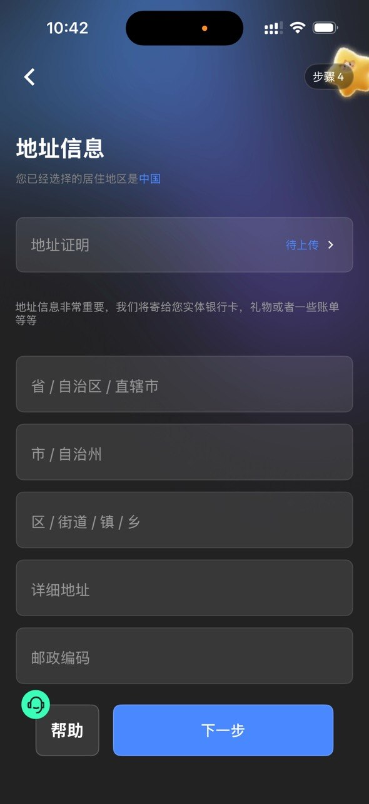

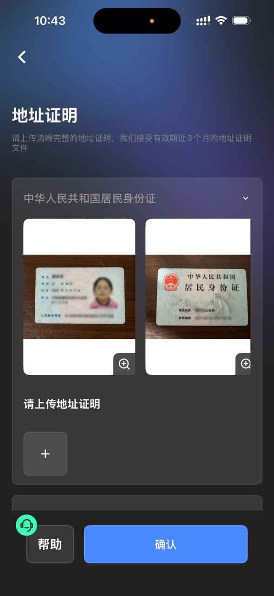

</div>

!!! info "无需提交银行账单"

    在地址证明环节，可以直接选择“中华人民共和国居民身份证”并上传身份证正反面，因此不需要另外提交银行账单。

## 注册完成后的说明

提交之后，审核一般等待几分钟就能通过！


## 提交前检查清单

提交注册申请前，建议再次确认：

- [ ] 居住国家或地区已经选择“中国”；
- [ ] Starryblu ID、密码和手机号已经填写；
- [ ] 手机短信验证码已经验证；
- [ ] 如需参加活动，推荐码已填写为 `MHQK00U`；
- [ ] 证件类型已经选择“中国护照”；
- [ ] 护照资料页清晰完整；
- [ ] 人脸识别已经完成；
- [ ] 个人身份信息与护照一致；
- [ ] 居住地址真实、完整；
- [ ] 身份证正反面已经作为地址证明上传；
- [ ] 所有证件图片均无反光、无模糊、无遮挡。

完成提交后，按照 App 页面提示等待审核即可。如果平台要求补充或重新提交材料，请直接在 App 内按照提示操作。


---

## 风险及推广说明

本文内容基于个人实际操作和测试结果，仅用于经验分享，不构成投资、法律、税务或金融建议。

文中部分链接或推荐码可能包含邀请关系，作者可能获得平台提供的邀请奖励，但不会增加用户正常注册和使用的费用。

所有活动奖励、手续费、汇率、免费提现额度及会员权益，请以用户操作时平台 App 显示的最新规则为准。


--8<-- "includes/links.md"