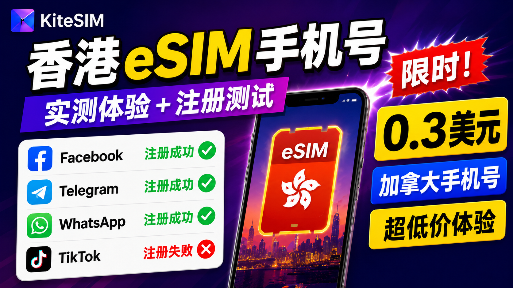

# 🗃️ 实测香港 eSIM 手机号 + 0.3美元加拿大手机号！能注册 Telegram、WhatsApp 吗？｜海外手机号测试｜eSIM保号

{ .hide-in-post width="300" align="left" style="border-radius: 8px; margin-right: 20px; box-shadow: 0 4px 10px rgba(0,0,0,0.1); margin-bottom: 10px;" }

<strong>本期看点：</strong>实测香港 eSIM 手机号和0.3美元加拿大号码，测试 Facebook、Telegram、WhatsApp 等海外账号注册效果。同时介绍 XESIM 转接卡，让不支持 eSIM 的手机也能使用海外 eSIM 套餐。

<!-- more -->

  <iframe src="https://www.youtube.com/embed/" style="position: absolute; top: 0; left: 0; width: 100%; height: 100%;" title="YouTube video player" frameborder="0" allow="accelerometer; autoplay; clipboard-write; encrypted-media; gyroscope; picture-in-picture" allowfullscreen></iframe>

---

## 📺 视频相关链接
1. Kitesim官网地址【`邀请码：7COD7U`】：[点击跳转][kitesim] 
1. Xesim 官网地址：[点击跳转][xesim]
1. TG交流群：[https://t.me/xiaovchat](https://t.me/xiaovchat)

!!! abstract "上方是视频中用到的网址。下方亦附有详细图文教程"

---
# KiteSIM 海外手机号 & 香港 eSIM 实测教程

本教程主要介绍 KiteSIM 提供的海外手机号和 eSIM 套餐，并测试香港 eSIM、0.3美元加拿大手机号的实际使用效果。

## 一、测试结果总结

本次主要测试：

- 香港 eSIM 手机号
- 0.3美元加拿大手机号
- XESIM 转接卡方案

### 香港 eSIM 测试结果

香港 eSIM 最大特点：

同时包含：

- 香港手机号
- 香港移动网络流量

实际测试结果：

|平台|结果|
|-|-|
|Facebook|✅ 注册成功|
|Telegram|✅ 注册成功|
|TikTok|❌ 未成功|

测试结论：

香港 eSIM 更适合：

- 跨境业务
- 海外社媒运营
- 需要海外网络环境的用户

【配图1：Facebook注册成功页面】

【配图2：Telegram注册成功页面】

---

### 0.3美元加拿大手机号测试结果

加拿大手机号特点：

价格低，主要用于短信验证码接收。

测试结果：

|平台|结果|
|-|-|
|WhatsApp|✅ 成功|
|Telegram|⚠️ 受环境影响|
|TikTok|❌ 失败|

【配图1：加拿大手机号价格页面】

【配图2：WhatsApp注册成功页面】

---

# 二、KiteSIM产品介绍

目前 KiteSIM 主要提供两类服务。

## 1. 海外手机号

支持：

- 美国手机号
- 英国手机号
- 加拿大手机号

主要用途：

接收短信验证码。

注意：

海外手机号套餐本身不包含移动流量。

其中加拿大手机号价格最低：

最低仅需0.3美元。

【配图1：手机号产品列表】

【配图2：加拿大手机号价格页面】

---

## 2. eSIM流量套餐

eSIM套餐需要：

- 支持eSIM的手机；
或者
- XESIM转接卡。

目前香港eSIM比较特殊：

同时包含：

- 香港手机号
- 香港流量

其他地区：

主要为流量套餐。

【配图1：eSIM套餐列表】

【配图2：香港eSIM套餐详情】

---

# 三、注册KiteSIM账号

打开注册链接：

https://h5.kitesim.co/register/?invite=7COD7U

邀请码：

7COD7U

完成注册后：

下载对应APP。

登录账号即可。

如果提示：

“该地区暂不提供服务”

检查：

- 当前网络环境；
- 代理设置。

【配图1：注册链接页面】

【配图2：APP登录页面】

---

# 四、购买香港eSIM套餐

进入APP：

选择香港eSIM套餐。

购买完成后：

进入：

订单 → 网络 → 未激活 → 立即激活

这里可以查看：

- eSIM信息
- 手机号码

【配图1：香港eSIM购买页面】

【配图2：订单激活页面】

---

# 五、香港eSIM写入手机

如果手机支持eSIM：

可以直接扫码添加。

如果使用国行手机：

由于系统限制，需要通过XESIM转接卡。

本次演示：

使用国行iPhone + XESIM。

---

## 写入步骤

首先：

使用微信或者支付宝扫描二维码。

提取eSIM信息。

然后进入：

设置

→ 蜂窝网络

→ XESIM卡槽

→ SIM卡应用程序

选择：

XESIM

→ 下载eSIM

【配图1：扫描二维码提取信息】

【配图2：XESIM下载eSIM入口】

复制刚才的信息。

粘贴后：

点击发送。

等待完成。

返回：

XESIM

→ eSIM列表

选择刚刚写入的香港号码。

启用eSIM。

【配图1：填写eSIM信息页面】

【配图2：eSIM列表页面】

---

# 六、开启香港eSIM网络

返回KiteSIM订单：

网络 → 使用中

这里可以查看电话号码。

开启：

数据漫游。

然后测试网络。

打开：

Google搜索

或者

IP检测网站。

【配图1：KiteSIM号码页面】

【配图2：香港IP检测结果】

---

# 七、香港eSIM注册测试

## Facebook

测试结果：

✅ 注册成功

【配图1：Facebook注册成功截图】

---

## Telegram

测试结果：

✅ 注册成功

可以正常：

- 接收验证码
- 完成注册

【配图1：Telegram验证码页面】

【配图2：Telegram账号页面】

---

## TikTok

测试结果：

❌ 未成功

原因：

香港地区限制影响相关服务。

如果主要需求是TikTok账号注册：

香港eSIM不是优先选择。

【配图1：TikTok失败结果页面】

---

# 八、0.3美元加拿大手机号测试

购买流程：

进入手机号专区。

选择加拿大号码。

点击激活。

【配图1：加拿大号码列表】

【配图2：激活页面】

---

## WhatsApp测试

输入手机号。

通过KiteSIM查看验证码。

测试结果：

✅ 注册成功

【配图1：验证码页面】

【配图2：WhatsApp成功页面】

---

## Telegram测试

测试未完成。

可能受到：

- 设备登录账号数量；
- 注册次数；
- 风控环境；

等因素影响。

---

# 九、XESIM转接卡方案

XESIM主要作用：

让不支持eSIM的手机，通过转接方式使用海外eSIM。

适合：

- 国行手机用户；
- 没有eSIM功能的设备。

【配图1：XESIM实物图】

【配图2：XESIM安装示意】

详细安装教程：

（此处插入XESIM详细教程）

---

# 十、总结

三个方案分别解决不同需求：

## 香港eSIM

适合：

需要海外网络环境，同时需要海外手机号的用户。

优势：

手机号 + 流量。

---

## 加拿大0.3美元手机号

适合：

低成本测试海外账号注册。

优势：

价格低。

---

## XESIM

适合：

手机不支持eSIM，但是希望使用海外eSIM套餐的用户。

---

不同平台对于手机号、IP环境以及设备信息要求不同。

本文测试结果仅代表本次实际测试情况。

!!! Warning "**免责声明**"
    本文档及相关教程内容仅供计算机网络技术交流与学习测试使用。请务必严格遵守您所在国家或地区的法律法规，切勿用于任何非法用途。
    
--8<-- "includes/links.md"