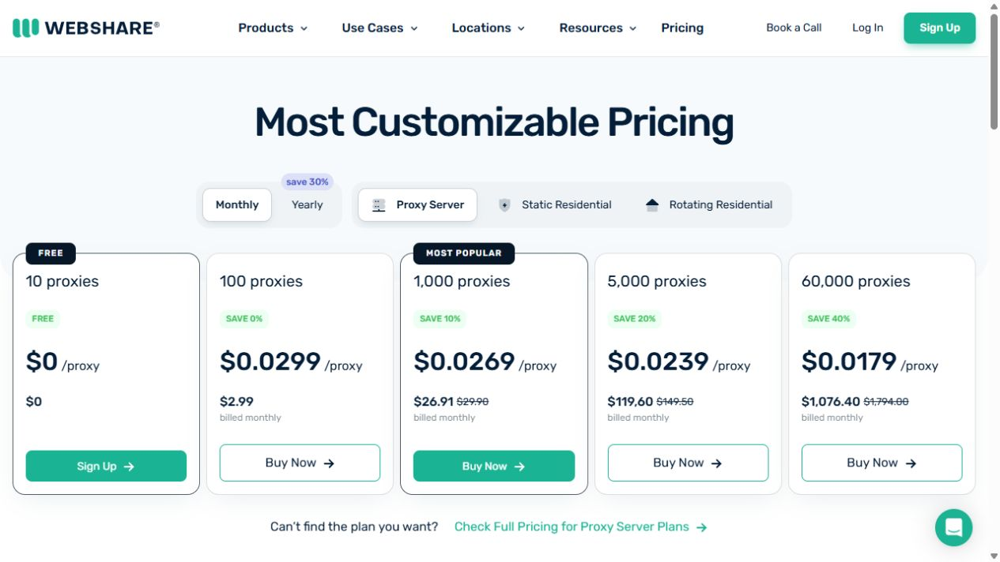
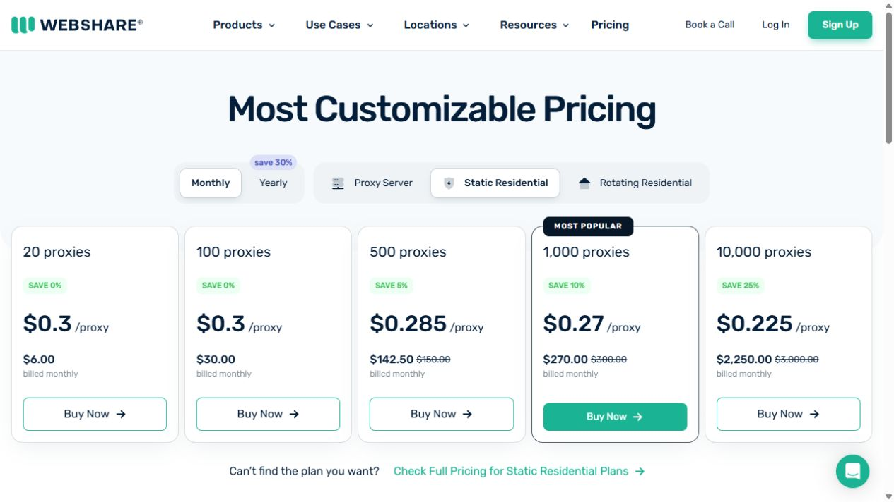
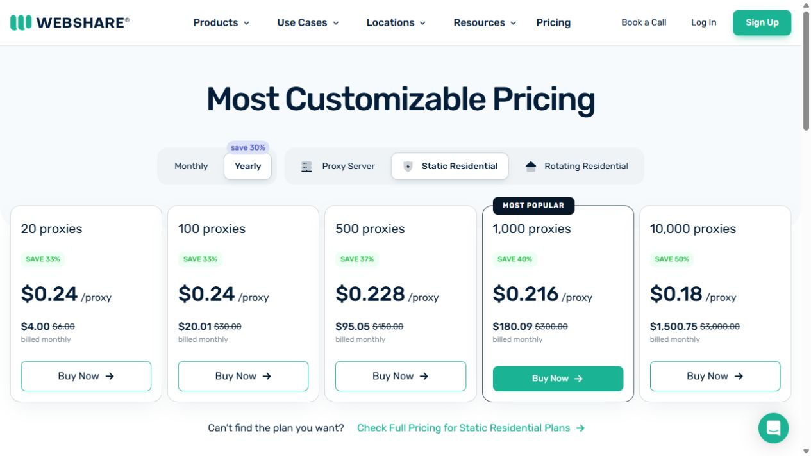
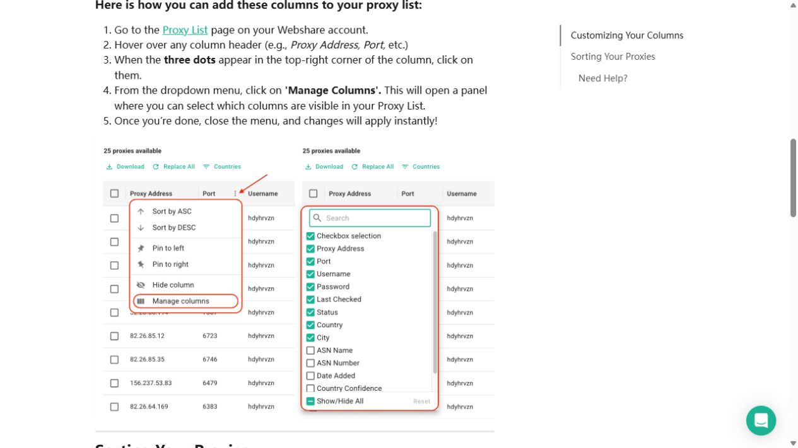
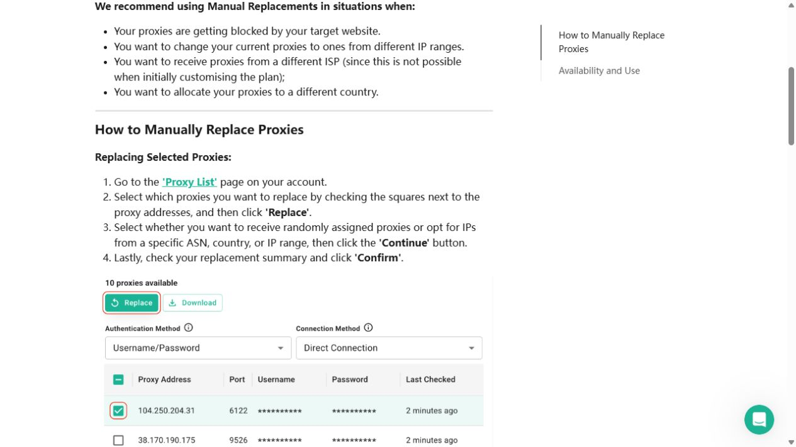

# 🔥 【静态住宅IP】月均不到8元！VPS搭建VPN + 链式代理完整教程丨自建节点丨科学上网丨3X-UI 3.6.0

{ .hide-in-post width="300" align="left" style="border-radius: 8px; margin-right: 20px; box-shadow: 0 4px 10px rgba(0,0,0,0.1); margin-bottom: 10px;" }

<p class="hide-in-post"><strong>本期看点：</strong>想要在出国旅游、出差时告别繁琐的换卡和高昂的漫游费？想要使用前沿 AI 工具或注册海外 App 却苦于没有境外号码？eSIM 绝对是完美的解决方案。</p>

<div style="clear: both;" class="hide-in-post"></div>

<!-- more -->

<style>
  /* 隐藏封面和摘要 */
  .hide-in-post { display: none !important; }
  /* 选填：给大标题上方加点间距，避免和挪下来的视频贴得太紧 */
  h1 { margin-top: 25px !important; }
</style>

<div id="top-video" style="position: relative; padding-bottom: 56.25%; height: 0; overflow: hidden; max-width: 100%; border-radius: 8px; margin-bottom: 20px; box-shadow: 0 4px 10px rgba(0,0,0,0.1);">
  <iframe src="https://www.youtube.com/embed/GaQ6iYDcHNI" style="position: absolute; top: 0; left: 0; width: 100%; height: 100%;" title="YouTube video player" frameborder="0" allow="accelerometer; autoplay; clipboard-write; encrypted-media; gyroscope; picture-in-picture" allowfullscreen></iframe>
</div>

<script>
  (function(){
    var video = document.getElementById('top-video');
    var h1 = document.querySelector('h1'); // 抓取文档生成的第一个大标题
    if(video && h1) {
      h1.parentNode.insertBefore(video, h1); // 把视频节点插入到大标题前面
    }
  })();
</script>


---

## 🔥 一、本期视频同款配置

### 1. **VPS 服务器：**
   - 👉 本期视频同款VPS（搬瓦工商务机）:[点击跳转](https://bwh81.net/aff.php?aff=81595&pid=87)
   - 📖 其他服务器（VPS）实测推荐：[点击查看详情][VPS推荐表]


### 2. **静态住宅 IP：**
   - 👉 本期视频同款静态IP（Webshare）:[点击跳转][webshare]
   - 📖 其他静态IP 实测推荐：[点击查看详情][静态代理推荐表]

- 💳 国际虚拟卡申请教程：
--8<-- "includes/videos.md:bybit_gljy"
--8<-- "includes/videos.md:Bybitcard"

## 🛠️ 二、配套软件与工具

1. V2rayN（Windows 电脑版）：[https://github.com/2dust/v2rayN/releases](https://github.com/2dust/v2rayN/releases)
1. V2rayNG（Android 手机版）：[https://github.com/2dust/v2rayNG/releases](https://github.com/2dust/v2rayNG/releases)
1. Clash Verge Rev（Windows 电脑版）：[https://github.com/Clash-Verge-rev/clash-verge-rev/releases](https://github.com/Clash-Verge-rev/clash-verge-rev/releases/latest?utm_source=chatgpt.com)
1. Clash Meta for Android(Android 手机端):[https://github.com/MetaCubeX](https://github.com/MetaCubeX/ClashMetaForAndroid/releases/latest?utm_source=chatgpt.com)
1. TG 交流群：[https://t.me/xiaovchat](https://t.me/xiaovchat)

## 🔗 三、独享节点（VPN）搭建

1. **服务器远程连接工具（FinalShell）：** [https://www.hostbuf.com/t/988.html](https://www.hostbuf.com/t/988.html)

2. **3X-UI一键部署命令(版本 3.6.0)：**
```bash
bash <(curl -Ls https://raw.githubusercontent.com/kjxv/3x-ui/video-v3.6.0/install.sh)
```

!!! abstract "上方是视频中用到的软件及相关网址"
     ❤️ 饮水思源，感谢 3X-UI 原作者 (mhsanaei) 的开源奉献！
     
     ➡️ 3X-UI 官方原项目地址：https://github.com/mhsanaei/3x-ui

---

## 一、Webshare 的三类代理有什么区别？

| 产品 | 主要特点 | 更适合的场景 |
| --- | --- | --- |
| Proxy Server | 机房代理，速度快、价格低，支持 HTTP 和 SOCKS5 | 普通网络测试、数据采集和对住宅属性要求不高的任务 |
| Static Residential | 也叫 ISP Proxy；IP 注册在真实 ISP 名下，但运行在服务器上，默认保持不变 | 需要固定出口、长期会话、账号登录或作为 VPS 的上游代理 |
| Rotating Residential | 使用较大的住宅 IP 池，可按请求或会话轮换，通常按流量计费 | 需要大量不同 IP、地区覆盖或大规模采集 |

静态住宅代理又分为 Shared/Premium、Private 和 Dedicated。Shared 价格较低；Private 最多与少量其他用户共享；Dedicated 为账号独享，价格也更高。

> 静态住宅代理是“住宅 ISP ASN + 服务器托管”的混合产品。不同检测网站可能把同一个 IP 标记为住宅、ISP、机房或 Hosting，这并不一定代表产品故障。是否适用，应以目标网站的实际访问结果、地区识别和 IP 信誉检测为准。



## 二、静态住宅代理怎么买？

注册并登录后，建议先完成邮箱验证。然后进入 **Plans & Pricing**，按下面的顺序选择：

1. 产品选择 **Static Residential**；
2. 选择月付或年付；
3. 选择 Shared/Private/Dedicated 等共享级别；
4. 选择代理数量、带宽和国家或地区；
5. 根据需要增加代理替换、自动刷新等功能；
6. 核对右侧价格和续费周期后，再进入结账页面。

如果是第一次使用，建议先月付小套餐测试，不要只因为折扣直接购买长期方案。



### 当前公开价格与视频价格的区别

本文核对时，公开价格页显示静态住宅代理从 **20 个 IP、6 美元/月**起售，包含 250GB 带宽的入门配置；这与视频拍摄时“自定义 1 个 IP、约 1.65 美元/月”的方案不同。

年付页面仍然提供优惠。公开页面顶部标注“最高节省约 30%”，不同档位显示的实际折扣可能不同；20 个 IP 套餐页面显示的月均等值约为 4 美元。年付通常按一个完整年度周期收费，不能把页面上的“月均价格”理解成按月扣款。



> 视频中的“一年 13.86 美元、折合每月不到 8 元”属于当时的旧套餐价格，不能作为现在下单时的价格承诺。

## 三、购买后在哪里查看代理信息？

登录控制台后，在左侧打开 **Static Residential → Proxy List**。代理列表中会显示：

- Proxy Address：代理服务器地址；
- Port：连接端口；
- Username：代理账号；
- Password：代理密码；
- Country、Last Checked 和当前状态等信息。

页面通常可以选择 **Username/Password** 验证方式，并选择 **Direct Connection**。复制连接信息时，需要把地址、端口、账号和密码四项一起保存；也可以使用页面的下载功能批量导出。



> 发布文章或视频时不要展示真实代理地址、账号和密码。代理凭据一旦泄露，应及时修改验证设置或联系官方支持处理。

## 四、IP 质量不满意时如何替换？

付费套餐当前每月包含 **10 次人工替换**。进入 Proxy List 后：

1. 勾选需要更换的代理；
2. 点击 **Replace**；
3. 选择随机分配，或指定国家、ASN、IP 段；
4. 点击 Continue，检查替换摘要；
5. 确认无误后再执行替换。

替换完成后，可以在 **Replaced** 标签页查看旧 IP、新 IP 和替换时间。人工替换次数按月重置，未使用的次数不会累计到下个月。



Webshare 还提供 Auto-Replace。它可以在代理长时间不可用、地区识别异常或性能下降时自动更换代理，并且不占用人工替换次数。但需要固定 IP 时不要长期随意开启；已经被替换的 IP 通常无法恢复。

> 视频口播中提到购买 50 次替换，这是旧套餐设置。当前公开帮助中心说明为每个付费套餐每月赠送 10 次人工替换，额外次数需要在 Plans & Pricing 中购买。

## 五、如何配合 VPS 做链式代理？

视频中的整体结构是：设备先连接自己 VPS 上的节点，再由 VPS 把指定流量转发到 Webshare 静态住宅代理。

```text
电脑或手机 → VPS 自建节点 → Webshare 静态住宅代理 → 目标网站
```

在 3X-UI 中添加出站时，协议选择 SOCKS，并填写 Webshare 提供的代理地址、端口、账号和密码；再用入站标签和出站标签建立路由规则。配置多个出口时，建议给每个出站和设备使用清晰的编号，避免路由关系混乱。

完成后应分别检查：

- VPS 直连节点能否正常联网；
- Webshare 代理地址、端口和密码是否正确；
- 路由规则是否把指定入站指向正确的出站；
- 最终 IP、国家和 DNS 是否符合预期。

固定不同出口只能减少设备之间共用 IP 的情况，并不能保证第三方平台不会通过浏览器指纹、账号资料或其他信号判断关联。请遵守目标网站规则及当地法律。

## 六、续费、修改套餐和取消订阅

Webshare 的付费计划默认自动续费：月付通常每 30 天续费一次；年付周期为 360 天，带宽配额仍按 30 天重置。

### 提前续费或升级

进入 **My Plan**，在对应计划上点击 **Upgrade → Continue**，然后在结账页核对并确认。修改代理数量、带宽、国家或附加功能时，旧计划未使用的时间和流量通常会折算为账户余额，用于抵扣新计划；修改后续费日期可能重新计算。

### 关闭自动续费

进入右上角 **Account Settings**，在 **Your Plan** 中找到 Auto-renewal，点击 **Disable Auto-Renewal** 并确认。关闭后，代理一般可以继续使用到当前订阅期结束；已保存的支付方式会被移除。以后重新付款时，自动续费可能再次开启。

### 直接取消订阅

取消订阅与关闭自动续费不同：取消计划可能立即把账号切换到免费计划，未使用部分通常以账户余额返还，但不等于原路退款。如果只是希望“到期不续”，优先关闭自动续费。

## 七、支付方式和注意事项

官方帮助中心目前列出的支付方式包括 Visa、Mastercard、American Express、Discover、Diners、银联、JCB 等银行卡，以及部分设备或地区可用的 Apple Pay、Google Pay；目前不支持 PayPal 和加密货币。最终可用方式以结账页为准。

- 下单前确认选择的是 Static Residential，而不是 Rotating Residential；
- 先查看国家库存和数量要求，某些地区不一定长期有货；
- 视频作者当时主要推荐美国 IP，这是个人测试经验，不代表官方对其他地区的质量保证；
- 重要业务不要只依赖单个代理，应准备替换方案并保存配置备份；
- IP 信誉和平台可用性会变化，购买前后都应自行测试。


!!! Warning "**免责声明**"
    本文档及相关教程内容仅供计算机网络技术交流与学习测试使用。请务必严格遵守您所在国家或地区的法律法规，切勿用于任何非法用途。
    
--8<-- "includes/links.md"
