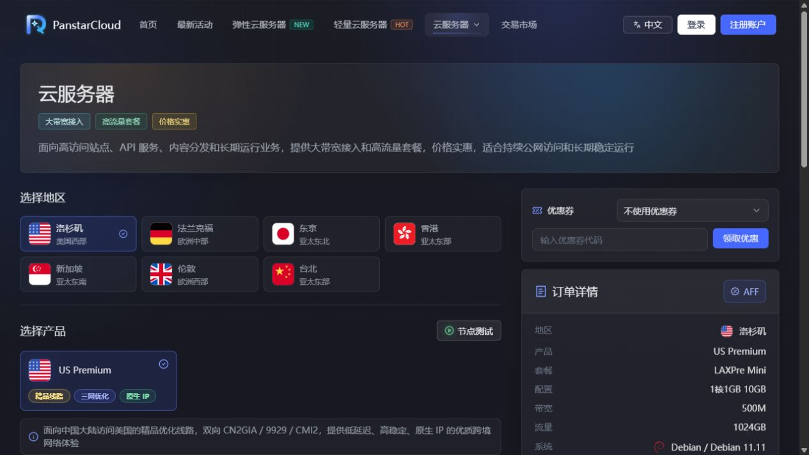
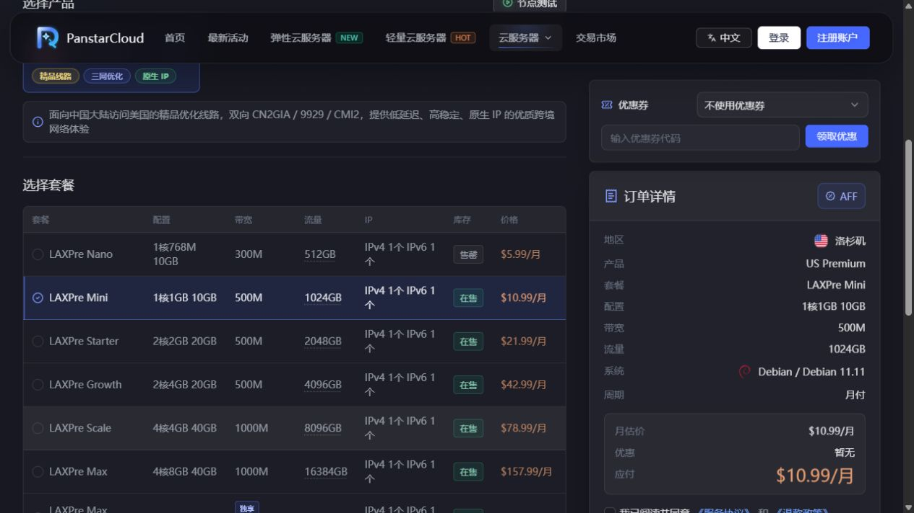
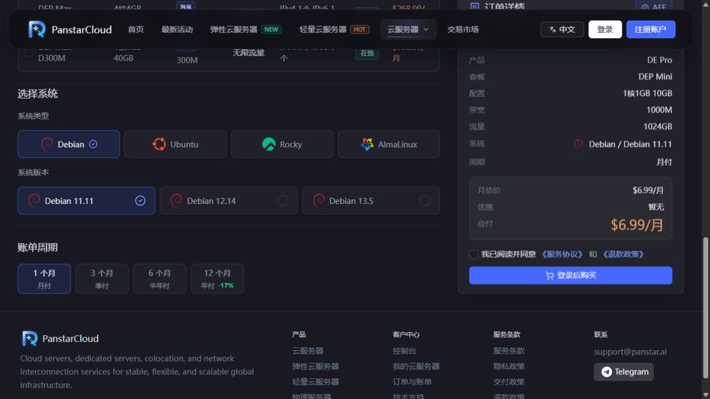
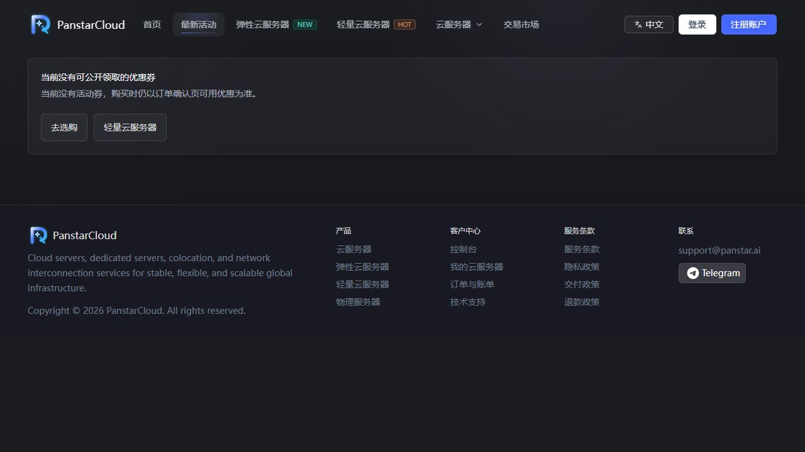
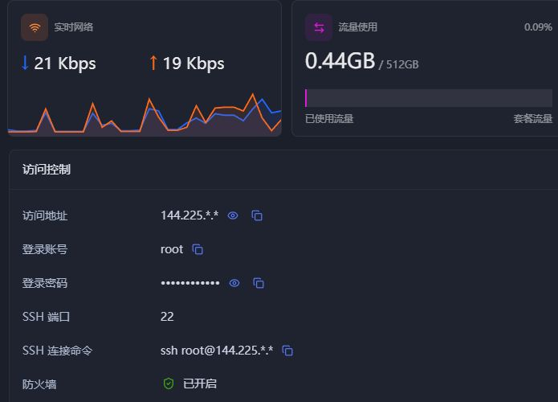

# 🚀 50元以内VPS推荐：低预算也能拥有精品线路（CN2｜9929｜CMIN2）｜VPN搭建｜VPS搭建

{ .hide-in-post width="300" align="left" style="border-radius: 8px; margin-right: 20px; box-shadow: 0 4px 10px rgba(0,0,0,0.1); margin-bottom: 10px;" }

<p class="hide-in-post"><strong>本期看点：</strong>想要在出国旅游、出差时告别繁琐的换卡和高昂的漫游费？想要使用前沿 AI 工具或注册海外 App 却苦于没有境外号码？eSIM 绝对是完美的解决方案。</p>

<div style="clear: both;" class="hide-in-post"></div>

<!-- more -->

<style>
  /* 隐藏封面和摘要 */
  .hide-in-post { display: none !important; }
  /* 选填：给大标题上方加点间距，避免和挪下来的视频贴得太紧 */
  h1 { margin-top: 25px !important; }
</style>

<div id="top-video" style="position: relative; padding-bottom: 56.25%; height: 0; overflow: hidden; max-width: 100%; border-radius: 8px; margin-bottom: 20px; box-shadow: 0 4px 10px rgba(0,0,0,0.1);">
  <iframe src="https://www.youtube.com/embed/dQO0tH9XIgY" style="position: absolute; top: 0; left: 0; width: 100%; height: 100%;" title="YouTube video player" frameborder="0" allow="accelerometer; autoplay; clipboard-write; encrypted-media; gyroscope; picture-in-picture" allowfullscreen></iframe>
</div>

<script>
  (function(){
    var video = document.getElementById('top-video');
    var h1 = document.querySelector('h1'); // 抓取文档生成的第一个大标题
    if(video && h1) {
      h1.parentNode.insertBefore(video, h1); // 把视频节点插入到大标题前面
    }
  })();
</script>


---

## 📺 一、视频相关链接

1. 👉 本期视频同款VPS（Panstar-5.99美元/月）:[点击跳转][panstar]
1. 📖 其他服务器（VPS）实测推荐：[点击查看详情][VPS推荐表]

>⚠️ 说明：价格、库存、配置和线路可能发生变化，请以下单时官网显示的信息为准。

---

## 🛠️ 二、配套软件与工具

1. V2rayN（Windows 电脑版）：[https://github.com/2dust/v2rayN/releases](https://github.com/2dust/v2rayN/releases)
1. V2rayNG（Android 手机版）：[https://github.com/2dust/v2rayNG/releases](https://github.com/2dust/v2rayNG/releases)
1. Clash Verge Rev（Windows 电脑版）：[https://github.com/Clash-Verge-rev/clash-verge-rev/releases](https://github.com/Clash-Verge-rev/clash-verge-rev/releases/latest?utm_source=chatgpt.com)
1. Clash Meta for Android(Android 手机端):[https://github.com/MetaCubeX](https://github.com/MetaCubeX/ClashMetaForAndroid/releases/latest?utm_source=chatgpt.com)
1. TG 交流群：[https://t.me/xiaovchat](https://t.me/xiaovchat)

---

## 🔗 三、服务器（连接及线路测试）

1. 服务器远程连接工具（FinalShell）： [https://www.hostbuf.com/t/988.html](https://www.hostbuf.com/t/988.html)


1. 安装Curl（由于系统调整，代码已更新）
```
apt-get install -y --allow-downgrades curl/bullseye
```

1. **可视化路由（NextTrace）安装命令**
```
curl nxtrace.org/nt | bash
```

---

测试命令：

1️⃣上海电信—回程测试地址命令：
```
nexttrace 202.96.209.133
```

2️⃣上海联通—回程测试地址命令：
```
nexttrace 210.22.97.1
```

3️⃣上海移动—回程测试地址命令：
```
nexttrace 120.204.197.126
```

---

## 🔣 四、享节点独（VPN）搭建

1. 3X-UI一键部署命令(版本 3.6.0)：
```bash
bash <(curl -Ls https://raw.githubusercontent.com/kjxv/3x-ui/video-v3.6.0/install.sh)
```


1. 测速网站：[speedtes.net](https://www.speedtest.net/)

!!! abstract "上方是视频中用到的网址。下方亦附有详细图文教程"


---

## 一、PanStar 有哪些产品？

官网目前主要提供标准云服务器、弹性云服务器和轻量云服务器等产品。其中，标准云服务器比较突出大带宽和高流量，购买页面还可以直接选择不同地区、系统和计费周期。

它的主要特点包括：

- 覆盖美国、德国、日本、中国香港、新加坡、英国和中国台湾等地区；
- 部分地区提供 CN2 GIA、9929、CMI2/CMIN2、IIJ 等面向中国大陆优化的线路；
- 部分产品提供原生 IP、DNS 解锁或国际线路优化；
- 套餐按月、季度、半年或年付，适合根据使用周期灵活选择。

> 线路名称说明：官网美国产品页面当前标注为 **CMI2**，口播文案中使用的是 **CMIN2**。两种写法在相关 VPS 介绍中都比较常见，购买时以官网实际线路说明和测试结果为准。

## 二、各地区服务器有什么特点？



| 地区 | 产品与线路特点 | 更适合的使用方向 |
| --- | --- | --- |
| 美国洛杉矶 | US Premium，三网优化，提供 CN2 GIA、9929、CMI2 等线路，并标注原生 IP | 重视中国大陆访问质量、希望兼顾带宽和流量 |
| 德国法兰克福 | DE Pro，原生 IP，面向中国大陆方向三网回程 9929，套餐页面标注 1Gbps 带宽 | 欧洲业务、欧洲建站或需要中欧访问的场景 |
| 日本东京 | JP Plus / JP Lite；Plus 标注三网 IIJ 直连并支持 DNS 解锁 | 东亚业务、低延迟访问、流媒体或日区服务 |
| 中国香港 | HK Standard / HK Lite；Standard 偏向中国移动方向优化并支持 DNS 解锁，Lite 偏国际线路和原生 IP | 香港及周边业务、海外访问或移动网络用户 |
| 新加坡 | SG Lite，国际线路优化、原生 IP，偏轻量和高流量使用 | 东南亚业务、海外建站和国际访问 |
| 英国伦敦 | UK Pro，英国原生 IP，面向中国大陆方向标注 9929，强调稳定和低丢包 | 英国或欧洲业务、对回程稳定性有要求的用户 |
| 中国台湾 | TW Lite，国际线路优化、原生 IP | 台湾地区业务、海外网络访问和轻量应用 |

不同运营商、不同时间段的实际网络表现会有差异。对延迟和线路要求较高时，建议先购买月付套餐测试，再决定是否长期续费。

## 三、套餐和价格怎么选？

以洛杉矶 US Premium 为例，核对时页面显示：Nano 套餐月付 5.99 美元，**货源紧缺，随时可能售罄**；Mini 套餐月付 10.99 美元并显示有库存。不同配置对应的 CPU、内存、硬盘、流量和带宽都不同，下单前应同时查看配置与库存，不要只看最低价格。



其他地区核对时的最低月付价格大致如下：德国 6.99 美元、日本 4.99 美元、中国香港 3.99 美元、新加坡 2.99 美元、英国 4.99 美元、中国台湾 2.99 美元。部分低价套餐可能处于售罄状态，实际可购买套餐以页面库存为准。

购买时还可以选择 Debian、Ubuntu、Rocky Linux、AlmaLinux 等系统，并选择月付、季付、半年付或年付。核对时年付选项标注约 **-17%**，但优惠比例可能变化。



## 四、优惠活动在哪里看？

官网设有“最新活动”页面。本文核对时，页面提示暂时没有公开可用的优惠码，因此不要默认某个历史优惠码长期有效。下单前可先打开活动页面，再比较不同账单周期的最终价格。



## 五、在哪里查看服务器账号和密码？

服务器开通后，进入控制后台，依次打开：

1. **控制台**；
2. **云服务器**；
3. 找到对应实例，点击 **管理**；
4. 进入 **仪表盘**，找到 **访问控制**。

在“访问控制”区域可以看到服务器访问地址、登录账号、密码、SSH 端口和 SSH 连接命令。Linux 服务器默认登录账号通常为 `root`，SSH 默认端口通常为 `22`，但仍应以后台实际显示为准。



> 截图中的 IP 地址和密码已经脱敏。请不要把真实服务器密码、完整 IP 或 SSH 命令公开到文章、视频和交流群中。首次登录后，建议及时修改密码，并限制不必要的端口访问。

## 六、服务器如何续费？

进入 **控制台 → 云服务器** 后，服务器列表会显示到期时间、自动续费状态以及单独的“续费”按钮；如果有多台服务器，也可以使用批量续费。进入某一台服务器的详情页，还可以在顶部点击“续费”，并在“计费信息”区域查看价格、开通时间、到期时间、自动续费和流量自动重置等信息。

续费时建议注意以下几点：

- 提前确认续费后的账单周期和最终金额；
- 打开自动续费前，先确认账户余额或支付方式是否可用；
- 不准备继续使用时，及时关闭自动续费，并提前备份网站和服务器数据；
- 低价或特殊线路套餐售罄后，能否原价续费要以控制台实际账单为准；
- 口播素材提到支付宝、Stripe 和 USDT，支付渠道可能调整，请以结账页面当前显示为准。

## 七、下单前的简单建议

- 先确定目标访客所在地区，再选择机房，不要只按最低价购买；
- 面向中国大陆用户时，重点看线路、晚高峰丢包和三网表现；
- 需要流媒体或地区服务时，除了“原生 IP”标识，还要自行测试实际解锁情况；
- 第一次使用建议先月付测试，确认性能、路由和稳定性后再考虑年付；
- 服务器不是自动备份服务，部署重要业务后应另外建立定期备份。

官方地址：[https://panstar/][panstar]

---

!!! Warning "**免责声明**"
    本文档及相关教程内容仅供计算机网络技术交流与学习测试使用。请务必严格遵守您所在国家或地区的法律法规，切勿用于任何非法用途。
    
--8<-- "includes/links.md"