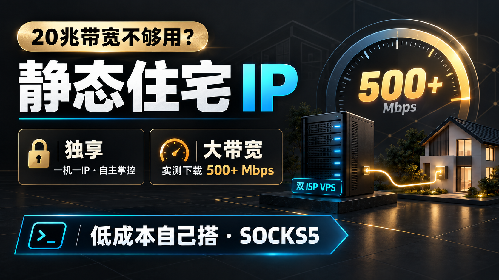

# 🏠 静态住宅IP带宽不够？几十元自建独享大带宽 SOCKS5，实测可达500M+｜TikTok直播网络搭建教程

{ .hide-in-post width="300" align="left" style="border-radius: 8px; margin-right: 20px; box-shadow: 0 4px 10px rgba(0,0,0,0.1); margin-bottom: 10px;" }

<p class="hide-in-post"><strong>本期看点：</strong>本期视频，我就教大家用一台双 ISP 静态住宅 VPS，自己部署成 SOCKS5 代理，最终得到和我们平时购买成品代理一样的 IP 地址、端口、账号和密码。</p>

<div style="clear: both;" class="hide-in-post"></div>

<!-- more -->

<style>
  /* 隐藏封面和摘要 */
  .hide-in-post { display: none !important; }
  /* 选填：给大标题上方加点间距，避免和挪下来的视频贴得太紧 */
  h1 { margin-top: 25px !important; }
</style>

<div id="top-video" style="position: relative; padding-bottom: 56.25%; height: 0; overflow: hidden; max-width: 100%; border-radius: 8px; margin-bottom: 20px; box-shadow: 0 4px 10px rgba(0,0,0,0.1);">
  <iframe src="https://www.youtube.com/embed/" style="position: absolute; top: 0; left: 0; width: 100%; height: 100%;" title="YouTube video player" frameborder="0" allow="accelerometer; autoplay; clipboard-write; encrypted-media; gyroscope; picture-in-picture" allowfullscreen></iframe>
</div>

<script>
  (function(){
    var video = document.getElementById('top-video');
    var h1 = document.querySelector('h1'); // 抓取文档生成的第一个大标题
    if(video && h1) {
      h1.parentNode.insertBefore(video, h1); // 把视频节点插入到大标题前面
    }
  })();
</script>


---

## 📺 视频相关链接
1. ➡️ 本期视频同款——美国双ISP静态VPS:[点击跳转](https://panstar.ai/servers?regionId=6&productId=30&planId=480&cycle=12&aff=DCAD1VCH)
1. 👉 本期视频同款——美国精品线路 300兆带宽中转VPS:[点击查看详情](https://panstar.ai/servers?regionId=6&productId=15&planId=393&cycle=1&aff=DCAD1VCH)
1. 🍺 本期视频同款——美国精品线路 2500兆带宽中转VPS:[点击查看详情](https://bwh81.net/aff.php?aff=81595&pid=87)
1. 📖 其他中转服务器（VPS）实测推荐：[点击查看详情][VPS推荐表]
1. ✈️ TG交流群：[https://t.me/xiaovchat](https://t.me/xiaovchat)

## 🛠️ 代理软件
1. V2rayN（Windows 电脑版）：[https://github.com/2dust/v2rayN/releases](https://github.com/2dust/v2rayN/releases)
1. V2rayNG（Android 手机版）：[https://github.com/2dust/v2rayNG/releases](https://github.com/2dust/v2rayNG/releases)
1. Clash Verge Rev（Windows 电脑版）：[https://github.com/Clash-Verge-rev/clash-verge-rev/releases](https://github.com/Clash-Verge-rev/clash-verge-rev/releases/latest?utm_source=chatgpt.com)
1. Clash Meta for Android(Android 手机端):[https://github.com/MetaCubeX](https://github.com/MetaCubeX/ClashMetaForAndroid/releases/latest?utm_source=chatgpt.com)
1. Shadowrocket(小火箭)，请自行在苹果AppStore中下载

## 🔠 视频相关命令：

1. 服务器远程连接工具（FinalShell）： [https://www.hostbuf.com/t/988.html](https://www.hostbuf.com/t/988.html)

1. 安装Curl（PanstarVPS需要安装Curl，其他推荐VPS不需要）
```
apt update && apt install -y curl
```

- 安装Curl（以上如果报错，尝试一下命令）
```
apt-get install -y --allow-downgrades curl/bullseye
```

1. 公网IP、网卡IP绑定、源路由IP检测命令
```
PUB=$(curl -4 -s --max-time 5 https://api.ipify.org); NICS=$(ip -4 -o addr show scope global | awk '{split($4,a,"/");print a[1]}'); SRC=$(ip -4 route get 1.1.1.1 2>/dev/null | awk '{for(i=1;i<=NF;i++)if($i=="src"){print $(i+1);exit}}'); echo "========== VPS 公网 IP 检测 =========="; echo "公网出口 IP：$PUB"; echo "网卡绑定 IP：$(echo "$NICS" | paste -sd ',' -)"; echo "路由源 IP：$SRC"; echo "--------------------------------------"; if echo "$NICS" | grep -Fxq "$PUB"; then echo "【通过】公网 IP 与网卡绑定 IP 一致"; A=1; else echo "【异常】公网 IP 未在本机网卡中找到"; A=0; fi; if [ "$PUB" = "$SRC" ]; then echo "【通过】公网 IP 与实际出站源 IP 一致"; B=1; else echo "【异常】公网 IP 与出站源 IP 不一致"; B=0; fi; echo "--------------------------------------"; if [ "$A" = 1 ] && [ "$B" = 1 ]; then echo "【综合结果：通过】"; echo "该公网 IP 已直接配置在当前 VPS，并作为实际出站 IP 使用。"; else echo "【综合结果：需要进一步检查】"; fi; echo "======================================"
```

1.  Socks5协议的静态IP部署命令（Multi-EasyGost）：
```
wget -O /root/gost.sh https://raw.githubusercontent.com/kjxv/Multi-EasyGost/v2/gost.sh && chmod +x /root/gost.sh && /root/gost.sh
```
> 项目原地址：https://github.com/KANIKIG/Multi-EasyGost感谢原作者 KANIKIG 以及所有参与该项目开发、维护和贡献的开源作者，为大家提供了简单易用的 Gost 管理脚本。

1. 菜单命令：
```
/root/gost.sh
```


1. 3X-UI一键部署命令(版本 3.6.0)：
```bash
bash <(curl -Ls https://raw.githubusercontent.com/kjxv/3x-ui/video-v3.6.0/install.sh)
```
> 项目原地址：https://github.com/mhsanaei/3x-ui感谢原作者 mhsanaei 以及所有参与该项目开发、维护和贡献的开源作者。

!!! abstract "上方是视频中用到的网址。"


---
# 使用 Multi-EasyGost 从零搭建 SOCKS5 代理

> 视频配套图文教程｜适用于本仓库 `v2` 分支  
> 项目地址：<https://github.com/kjxv/Multi-EasyGost>

本教程介绍如何在一台全新的 Linux VPS 上安装 GOST、创建带账号密码的 SOCKS5 代理、放行端口并验证代理出口。完成后，你将得到以下连接信息：

```text
代理类型：SOCKS5
服务器：VPS 公网 IP
端口：你设置的端口
用户名：你设置的用户名
密码：你设置的密码
```

## 一、开始前需要准备

你需要：

- 一台拥有公网 IP 的 Linux VPS；
- VPS 的 root 密码，或一个可以使用 `sudo` 的账号；
- 能够登录 VPS 的 SSH 工具；
- 一个尚未被其他程序占用的端口，例如 `20001`；
- 在云服务商后台修改安全组或云防火墙的权限。

本脚本适用于使用 systemd 的常见 Debian、Ubuntu、CentOS 等发行版。SOCKS5 代理不需要域名。

教程中的示例信息如下，请在实际使用时替换：

| 项目 | 教程示例 | 你的实际信息 |
| --- | --- | --- |
| VPS 公网 IP | `203.0.113.10` | VPS 后台显示的公网 IP |
| SOCKS5 端口 | `20001` | 建议使用未占用的高位端口 |
| 用户名 | `proxyuser` | 自行设置 |
| 密码 | `ChangeMe_2026` | 请换成自己的强密码 |

> `203.0.113.10` 是文档示例地址，不能直接使用。

## 二、登录 VPS 并切换到 root

使用 SSH 登录 VPS 后执行：

```bash
sudo -i
```

如果已经使用 root 账号登录，或者系统没有 `sudo`，可以跳过这一步。

确认当前账号：

```bash
whoami
```

正常情况下应返回：

```text
root
```

## 三、一键下载并启动脚本

执行以下命令：

```bash
wget -O /root/gost.sh https://raw.githubusercontent.com/kjxv/Multi-EasyGost/v2/gost.sh && chmod +x /root/gost.sh && /root/gost.sh
```

这条命令会：

1. 从本仓库下载 `gost.sh`；
2. 保存到 `/root/gost.sh`；
3. 添加执行权限；
4. 打开脚本主菜单。

以后再次进入菜单只需要执行：

```bash
/root/gost.sh
```

如果提示 `wget: command not found`，可根据系统安装：

```bash
# Debian / Ubuntu
apt-get update && apt-get install -y wget
```

```bash
# CentOS / Rocky Linux / AlmaLinux
yum install -y wget
```

## 四、安装 GOST

进入主菜单后输入：

```text
1
```

选择“安装 gost”。

脚本会询问是否使用大陆镜像：

- 境外 VPS：建议输入 `n`，从 GOST 官方 GitHub Release 下载；
- 中国大陆 VPS、访问 GitHub Release 困难：可以输入 `y`，使用脚本提供的第三方二进制镜像。

看到以下提示，代表安装完成：

```text
gost安装成功
```

当前脚本固定安装 **GOST v2.11.2**。

## 五、创建第一个 SOCKS5 代理

安装结束后重新进入菜单：

```bash
/root/gost.sh
```

按照以下顺序选择：

```text
7 → 新增 gost 转发配置
4 → 一键安装 ss/socks5/http 代理
2 → socks5
```

脚本随后会按照下面的顺序询问信息。

### 1. 输入 SOCKS5 密码

示例：

```text
ChangeMe_2026
```

### 2. 输入 SOCKS5 用户名

示例：

```text
proxyuser
```

### 3. 输入 SOCKS5 服务端口

示例：

```text
20001
```

建议每个代理使用不同的高位端口。首次测试时，用户名和密码尽量使用字母、数字、下划线和短横线，避免特殊字符影响代理 URL 或配置解析。

输入完成后，脚本会：

1. 把原始规则写入 `/etc/gost/rawconf`；
2. 重新生成 `/etc/gost/config.json`；
3. 重启 GOST；
4. 显示当前配置列表。

此时你的 SOCKS5 信息为：

```text
服务器：你的 VPS 公网 IP
端口：20001
用户名：proxyuser
密码：ChangeMe_2026
```

## 六、放行 SOCKS5 端口

只在脚本中创建代理还不够，还需要放行端口。

### 1. 云服务商安全组

进入 VPS 服务商后台，找到安全组、云防火墙或入站规则，添加：

| 协议 | 端口 | 来源 |
| --- | --- | --- |
| TCP | `20001` | 建议填写你的固定公网 IP |
| UDP | `20001` | 只有需要 SOCKS5 UDP 时才添加 |

为了安全，不建议长期将代理端口对所有来源开放。如果不知道自己的公网 IP，可以先临时测试，确认可用后再收紧来源范围。

### 2. VPS 系统防火墙

如果使用 UFW：

```bash
ufw allow 20001/tcp
ufw allow 20001/udp
ufw status
```

如果使用 firewalld：

```bash
firewall-cmd --permanent --add-port=20001/tcp
firewall-cmd --permanent --add-port=20001/udp
firewall-cmd --reload
```

只需要执行适合当前系统的命令。如果系统没有启用这些防火墙工具，不必为了本教程同时安装两套防火墙。

## 七、检查服务和监听端口

查看 GOST 服务状态：

```bash
systemctl status gost --no-pager
```

正常状态应包含：

```text
active (running)
```

检查端口是否被监听：

```bash
ss -lntup | grep ':20001'
```

查看最近 100 行日志：

```bash
journalctl -u gost -n 100 --no-pager
```

## 八、从客户端验证 SOCKS5

最好在自己的电脑或另一台服务器上测试，不要只在 VPS 本机测试。

### Linux 或 macOS

```bash
curl --proxy socks5h://203.0.113.10:20001 --proxy-user 'proxyuser:ChangeMe_2026' https://api.ipify.org
```

### Windows PowerShell

```powershell
curl.exe --proxy socks5h://203.0.113.10:20001 --proxy-user "proxyuser:ChangeMe_2026" https://api.ipify.org
```

请把示例 IP、端口、用户名和密码换成自己的信息。

如果返回的是 VPS 的公网出口 IP，说明以下环节都已正常：

- GOST 服务正在运行；
- SOCKS5 端口可以从公网访问；
- 用户名和密码正确；
- 客户端流量已经通过代理发出。

还可以先查看本机直连出口：

```bash
curl https://api.ipify.org
```

再运行代理测试命令，对比两次结果是否不同。

## 九、在代理软件中填写

在浏览器代理插件、系统代理工具或其他客户端中新增代理时填写：

| 字段 | 填写内容 |
| --- | --- |
| 类型 | SOCKS5 |
| 服务器/主机 | VPS 公网 IP |
| 端口 | 例如 `20001` |
| 用户名 | 创建代理时输入的用户名 |
| 密码 | 创建代理时输入的密码 |
| 代理 DNS | 建议开启，或选择 SOCKS5 远程 DNS |

不同客户端的字段名称可能不同，但所需信息相同。

## 十、创建第二个或第三个 SOCKS5

再次进入脚本：

```bash
/root/gost.sh
```

每增加一个 SOCKS5，都重复：

```text
7 → 4 → 2
```

例如：

| 配置 | 端口 | 用户名 |
| --- | --- | --- |
| SOCKS5 #1 | `20001` | `user1` |
| SOCKS5 #2 | `20002` | `user2` |
| SOCKS5 #3 | `20003` | `user3` |

每条配置必须使用不同端口，并分别放行对应端口。

> 同一台 VPS 上创建多个 SOCKS5，只会得到多个代理入口。它们仍然共享同一台 VPS 的公网出口 IP。要获得不同出口 IP，通常需要使用多台 VPS，或额外配置服务器实际拥有的多个公网 IP。

## 十一、查看或删除配置

### 查看所有配置

运行脚本后输入：

```text
8
```

左侧序号是配置编号。

### 删除指定配置

运行脚本后输入：

```text
9
```

脚本会先显示所有配置。输入要删除的编号后，它会：

1. 删除对应规则；
2. 重新生成 GOST 配置；
3. 重启 GOST。

删除前建议先备份：

```bash
cp /etc/gost/rawconf /etc/gost/rawconf.backup
```

配置删除后，列表编号可能重新排列。再次删除前应先重新查看列表。

## 十二、日常管理命令

### 进入管理菜单

```bash
/root/gost.sh
```

常用菜单：

| 选项 | 功能 |
| --- | --- |
| 4 | 启动 GOST |
| 5 | 停止 GOST |
| 6 | 根据原始规则重建配置并重启 |
| 7 | 新增配置 |
| 8 | 查看配置 |
| 9 | 删除配置 |

也可以直接使用 systemd：

```bash
systemctl start gost
systemctl stop gost
systemctl restart gost
systemctl status gost --no-pager
```

主要文件：

```text
/root/gost.sh          管理脚本
/etc/gost/rawconf      原始规则和代理账号信息
/etc/gost/config.json  GOST 实际读取的配置
/usr/bin/gost          GOST 程序
```

## 十三、常见问题排查

### 1. 客户端连接超时

依次检查：

1. VPS 公网 IP 是否正确；
2. 云服务商安全组是否放行 TCP 端口；
3. VPS 系统防火墙是否放行；
4. GOST 是否监听该端口；
5. 本地网络是否限制代理连接。

### 2. 提示连接被拒绝

通常表示端口没有程序监听。执行：

```bash
systemctl restart gost
systemctl status gost --no-pager
ss -lntup | grep ':20001'
```

### 3. 用户名或密码验证失败

- 确认客户端信息与创建时完全一致；
- 注意大小写；
- 检查复制时是否带入空格；
- 首次排查时避免在账号密码中使用 `@`、`:`、`/`、`#` 等特殊字符。

### 4. 服务启动失败

查看日志：

```bash
journalctl -u gost -n 100 --no-pager
```

也可以运行脚本并选择 `8` 查看已有配置，确认端口没有重复。

### 5. 代理可以连接，但出口 IP 没变化

- 确认客户端确实启用了 SOCKS5，而不是直连；
- 浏览器插件应让目标网站流量经过代理；
- 建议使用 `socks5h` 或开启“代理 DNS”；
- 使用本教程中的 `curl` 命令进行独立验证。

### 6. 多个 SOCKS5 显示相同出口 IP

这是正常现象。同一台 VPS 上的多个端口默认共享同一个公网出口 IP。

## 十四、安全注意事项

- 使用足够长、随机且不重复的密码；
- 尽可能在安全组中只允许自己的公网 IP 访问代理端口；
- 不要把账号密码发布到视频画面、评论区、公开文档或截图中；
- 定期查看 `journalctl -u gost` 和 VPS 流量，发现异常及时更换密码或关闭端口；
- `/etc/gost/rawconf` 和 `/etc/gost/config.json` 含有代理凭据，不要公开；
- 当前底层 GOST 固定为 v2.11.2，版本较旧，应自行关注安全公告；
- 搭建和使用代理时，应遵守 VPS 服务商条款及所在地法律法规。

## 十五、卸载

如果确定不再使用，进入脚本后选择：

```text
3 → 卸载 gost
```

该操作会删除 GOST 程序、`/etc/gost` 配置目录以及当前目录中的 `gost.sh`，执行前请先备份需要保留的配置。

## 快速操作卡片

```text
首次部署：
sudo -i
wget -O /root/gost.sh https://raw.githubusercontent.com/kjxv/Multi-EasyGost/v2/gost.sh && chmod +x /root/gost.sh && /root/gost.sh

安装 GOST：
主菜单选择 1

创建 SOCKS5：
主菜单 7 → 功能 4 → 代理类型 2
依次输入：密码 → 用户名 → 端口

再次进入菜单：
/root/gost.sh

查看配置：
主菜单选择 8

删除配置：
主菜单选择 9

验证代理：
curl --proxy socks5h://VPS_IP:端口 --proxy-user '用户名:密码' https://api.ipify.org
```

## 项目来源

本仓库基于 [KANIKIG/Multi-EasyGost](https://github.com/KANIKIG/Multi-EasyGost) 修改维护，底层使用 [ginuerzh/gost](https://github.com/ginuerzh/gost)。项目继续遵循 GPL-3.0 许可证，并保留原项目来源说明。


!!! Warning "**免责声明**"
    本文档及相关教程内容仅供计算机网络技术交流与学习测试使用。请务必严格遵守您所在国家或地区的法律法规，切勿用于任何非法用途。
    
--8<-- "includes/links.md"