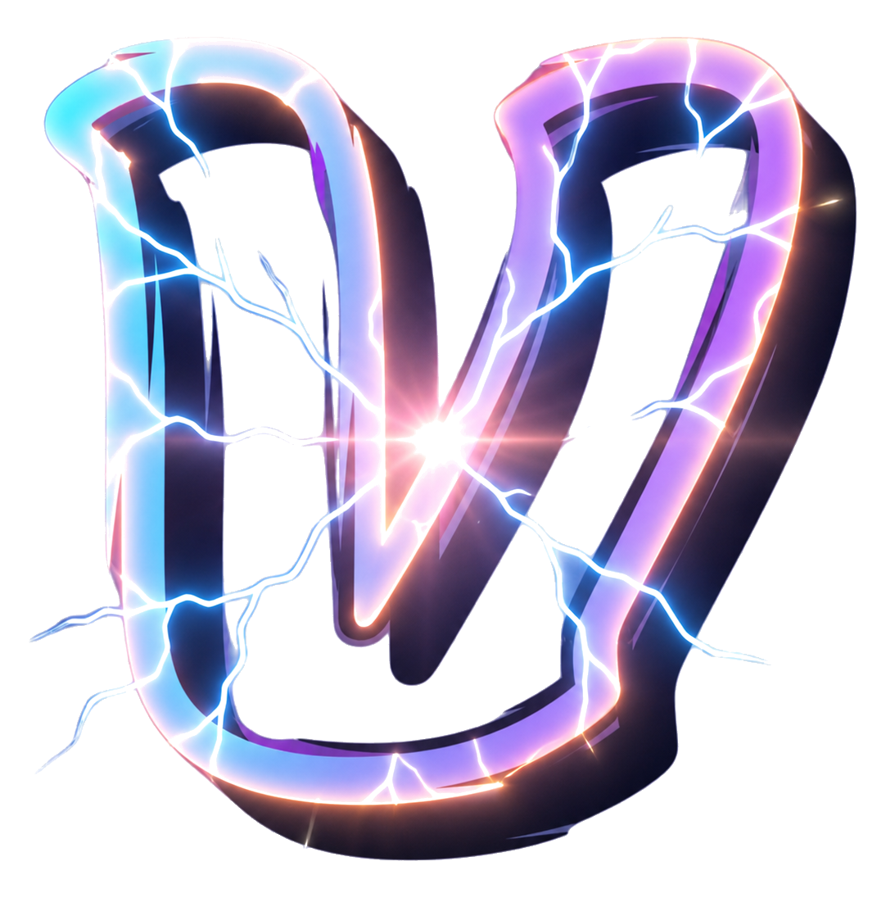

---
# 1. YAML 配置：彻底隐藏导航栏、右侧目录、默认页脚，只留纯净首屏
hide:
  - navigation
  - toc
  - footer
---

    

    <video autoplay loop muted playsinline>
        <source src="assets/home-bg.mp4" type="video/mp4">
    </video>

    

        
        

            <a href="http://127.0.0.1:8000/blog/" class="hero-btn btn-cyan">视频文档</a>
            <a href="http://127.0.0.1:8000/recommend/" class="hero-btn btn-glass">站长推荐</a>
        

    

    

        
Digital Playground

        

            Welcome everybody!
            Explore videos, tools, and ideas.
            Build smarter. Share better.
        

    

