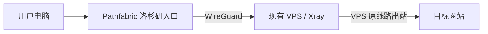
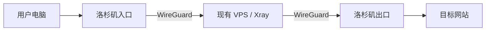

# 国内手机如何免换机开通海外 eSIM？Xesim 保姆级图文教程

{ .hide-in-post width="300" align="left" style="border-radius: 8px; margin-right: 20px; box-shadow: 0 4px 10px rgba(0,0,0,0.1); margin-bottom: 10px;" }

<p class="hide-in-post"><strong>本期看点：</strong>想要在出国旅游、出差时告别繁琐的换卡和高昂的漫游费？想要使用前沿 AI 工具或注册海外 App 却苦于没有境外号码？eSIM 绝对是完美的解决方案。</p>

<div style="clear: both;" class="hide-in-post"></div>

<!-- more -->

<style>
  /* 隐藏封面和摘要 */
  .hide-in-post { display: none !important; }
  /* 选填：给大标题上方加点间距，避免和挪下来的视频贴得太紧 */
  h1 { margin-top: 25px !important; }
</style>

<div id="top-video" style="position: relative; padding-bottom: 56.25%; height: 0; overflow: hidden; max-width: 100%; border-radius: 8px; margin-bottom: 20px; box-shadow: 0 4px 10px rgba(0,0,0,0.1);">
  <iframe src="https://www.youtube.com/embed/K1D0bB-qm8A" style="position: absolute; top: 0; left: 0; width: 100%; height: 100%;" title="YouTube video player" frameborder="0" allow="accelerometer; autoplay; clipboard-write; encrypted-media; gyroscope; picture-in-picture" allowfullscreen></iframe>
</div>

<script>
  (function(){
    var video = document.getElementById('top-video');
    var h1 = document.querySelector('h1'); // 抓取文档生成的第一个大标题
    if(video && h1) {
      h1.parentNode.insertBefore(video, h1); // 把视频节点插入到大标题前面
    }
  })();
</script>


---
# Pathfabric 中转部署与 X-UI/Xray 节点接入教程

> 适用场景：在一台全新的 Linux VPS，或已经安装 X-UI/Xray 并运行节点的 VPS 上，部署 Pathfabric WireGuard 隧道，获得一个新的洛杉矶公网 IPv4，并选择将它用作入站 IP 或整台服务器的默认出站 IP。
>
> 本教程中的 IP、域名、端口和密钥均为占位符。不要把一次性安装链接、WireGuard 私钥或包含私钥的配置文件发送给他人。

## 1. Pathfabric 是什么

Pathfabric 不是新的 VPS，也不是代理面板。它会把一个洛杉矶公网 IPv4 `/32`，通过 WireGuard、GRE 或 IPIP 隧道挂载到现有 Linux 服务器上。

部署完成后，同一台 VPS 会同时拥有：

- VPS 提供商原来的公网 IP，例如 `<VPS_ORIGINAL_IP>`；
- Pathfabric 分配的新公网 IP，例如 `<PATHFABRIC_IP>`；
- 原服务器上的 X-UI、Xray、网站和文件不会因为新增 IP 而自动复制，它们仍然运行在同一台机器上；
- 只要服务监听所有地址，就可以同时通过两个公网 IP 访问。

官方资料：

- [Pathfabric Linux 安装手册](https://pathfabric.com/docs)
- [网络与隧道说明](https://pathfabric.com/network)
- [价格页面](https://pathfabric.com/pricing)

## 2. 两种路由模式

### 2.1 `default`：推荐的初始模式

Pathfabric 新 IP 用于入站，服务器普通出站仍使用 VPS 原线路。



在该模式下：

- 连接 `<PATHFABRIC_IP>` 的入站流量通过 Pathfabric 到达 VPS；
- 入站连接的响应会沿 Pathfabric 隧道返回；
- Xray、系统更新、下载任务等新建的普通出站连接仍使用 `<VPS_ORIGINAL_IP>`；
- 原 SSH 管理地址保持不变；
- 更适合先测试、分流和控制流量费用。

### 2.2 `tunnel`：整台 VPS 默认从 Pathfabric 出站



在该模式下：

- 普通 IPv4 出站默认使用 `<PATHFABRIC_IP>`；
- 目标网站看到的是 Pathfabric IP；
- 适合固定出口 IP、API 白名单或需要洛杉矶公网身份的场景；
- 所有普通出站流量都可能产生 Pathfabric 流量费用；
- 如果 VPS 位于香港而用户在中国大陆，香港与洛杉矶之间的绕行通常会显著增加延迟。

## 3. 部署前的要求

### 3.1 支持的环境

官方安装器要求：

- x86_64 VPS 或物理服务器；
- root/sudo 权限；
- systemd；
- 一个工作正常的原始 IPv4 和默认路由；
- Ubuntu Server 22.04/24.04/26.04、Debian 11/12/13、AlmaLinux或 Rocky Linux 8–10；
- 一台服务器只能有一个由安装器管理的 Pathfabric 服务。

不支持 Windows、macOS、容器内直接安装、ARM、Ubuntu 20.04 和 IPv6 Pathfabric 路由。

### 3.2 安装前检查

```bash
uname -m
cat /etc/os-release
ps -p 1 -o comm=
ip -4 route show default
```

预期结果包括：

```text
x86_64
Ubuntu/Debian/AlmaLinux/Rocky Linux
systemd
```

在修改网络前：

1. 保持当前 SSH/FinalShell 会话打开；
2. 确认可以使用云服务商网页控制台、VNC 或串口控制台；
3. 记录原公网 IP、Ping、丢包率和下载速度；
4. 不要同时运行多个 Pathfabric 安装、切换或卸载操作。

## 4. 创建 Pathfabric 服务

1. 注册并登录 Pathfabric；
2. 充值并创建服务；
3. 测试阶段可先选择 100 Mbps 或 200 Mbps 计量套餐；
4. 隧道类型建议选择 **WireGuard**；
5. WireGuard 支持 NAT，有加密，通常比 GRE/IPIP 更容易部署；
6. 创建并激活服务后，进入服务的 **Configuration** 页面。

### 4.1 WireGuard 密钥的两种情况

#### 情况 A：安装器包含 Pathfabric 生成的私钥

如果 Pathfabric 仍持有其生成的私钥，安装器会自动使用它。此时安装脚本本身包含秘密，必须设置为仅 root 可读并妥善保存。

#### 情况 B：已经下载过 WireGuard 配置，或后台使用现有公钥

如果已经下载过一次：

```text
pathfabric-wireguard.conf
```

或者后台登记的是用户提供的公钥，安装器通常不会再包含私钥。安装时需要提供一个只包含 WireGuard 私钥的 root 专用文件。

## 5. 获取一次性 Linux 安装链接

在服务配置页面找到：

```text
生成安装链接 / 安装链接 / Download Linux installer
```

注意区分：

- `pathfabric-wireguard.conf` 是 WireGuard 配置，不是安装器；
- `pathfabric-install.sh` 才是 Linux 一键安装脚本；
- 安装链接 24 小时后失效；
- 链接只能被成功下载一次；
- WGET、CURL、浏览器下载三种方式只能选一种；
- 不要截图、分享或公开一次性链接；
- 如果链接意外暴露，应返回后台重新生成，使旧的未使用链接失效。

## 6. 下载并检查安装器

推荐直接在 VPS 中使用 CURL：

```bash
umask 077
curl -fL -o pathfabric-install.sh '<ONE_TIME_INSTALLER_URL>'
chmod 700 pathfabric-install.sh
ls -lh pathfabric-install.sh
./pathfabric-install.sh --help
```

也可以使用 WGET：

```bash
umask 077
wget -O pathfabric-install.sh '<ONE_TIME_INSTALLER_URL>'
chmod 700 pathfabric-install.sh
./pathfabric-install.sh --help
```

不要使用：

```bash
curl '<URL>' | bash
```

保存 `pathfabric-install.sh`，以后切换网关和卸载时还会使用。

## 7. 准备用户持有的 WireGuard 私钥

如果安装器提示：

```text
WireGuard private-key file:
```

说明安装器不包含私钥。按 `Ctrl+C` 退出提示，然后执行以下步骤。

### 7.1 上传配置

通过 FinalShell/SFTP 将电脑上的：

```text
pathfabric-wireguard.conf
```

上传到：

```text
/root/pathfabric-wireguard.conf
```

设置权限：

```bash
chmod 600 /root/pathfabric-wireguard.conf
```

### 7.2 提取私钥

不要使用 `cat` 展示配置或私钥。使用下面的命令提取：

```bash
sed -n 's/^[[:space:]]*PrivateKey[[:space:]]*=[[:space:]]*//p' \
  /root/pathfabric-wireguard.conf |
  tr -d '\r' > /root/pathfabric.key

chmod 600 /root/pathfabric.key
```

只检查格式，不显示私钥：

```bash
echo "行数：$(wc -l < /root/pathfabric.key)"
echo "字符数：$(tr -d '\r\n' < /root/pathfabric.key | wc -c)"
```

标准 WireGuard 私钥通常应显示：

```text
行数：1
字符数：44
```

如果结果不同，不要继续安装，也不要公开文件内容。应检查上传的配置是否与当前 Pathfabric 服务匹配。

## 8. 一键安装 Pathfabric

### 8.1 推荐：先使用 `default` 模式

安装器包含私钥时：

```bash
sudo ./pathfabric-install.sh --install \
  --default-gateway=default
```

使用用户持有的私钥时：

```bash
sudo ./pathfabric-install.sh --install \
  --default-gateway=default \
  --wireguard-private-key-file=/root/pathfabric.key
```

安装器会先显示完整计划，并询问：

```text
Apply? [y/N]:
```

确认以下内容正确：

- `Tunnel: WIREGUARD`；
- 原始网卡、原公网 IP 和原网关正确；
- `Assigned public IPv4` 是后台分配的 Pathfabric `/32`；
- `Routing mode: default`；
- 原提供商默认路由不会被替换；
- 已启用两分钟自动回滚保护。

确认无误后输入：

```text
y
```

不要关闭 SSH，等待出现：

```text
Pathfabric installation completed successfully. Routing mode: default
```

### 8.2 无人值守安装

只有在已经完整验证过环境后才使用：

```bash
sudo ./pathfabric-install.sh --install --unattended \
  --default-gateway=default \
  --wireguard-private-key-file=/root/pathfabric.key
```

如果安装器自带私钥，去掉最后一项即可。

## 9. 安装后验证

### 9.1 查看接口和新 IP

```bash
ip -br -4 addr show pf-wg
ip -br -4 addr show pf-public
```

一般会出现：

```text
pf-wg
pf-public  UP  <PATHFABRIC_IP>/32
```

### 9.2 验证 `default` 模式

普通出站：

```bash
curl -4 https://api.ipify.org
echo
```

应返回：

```text
<VPS_ORIGINAL_IP>
```

绑定 Pathfabric IP 出站：

```bash
curl -4 --interface <PATHFABRIC_IP> https://api.ipify.org
echo
```

应返回：

```text
<PATHFABRIC_IP>
```

### 9.3 测试 SSH

不要关闭原 SSH 会话。在 FinalShell 中新建连接：

```text
主机：<PATHFABRIC_IP>
端口：原 SSH 端口
用户名/密码/密钥：与原连接相同
```

能够通过新 IP 登录同一台服务器，说明基本入站及回程路由正常。

## 10. 已经安装 X-UI/Xray 的 VPS 怎么接入

不需要重新安装 X-UI，也不需要在 Pathfabric IP 上重新部署节点。Pathfabric IP 是同一台 VPS 的第二个公网入口。

### 10.1 检查监听地址

```bash
sudo ss -lntup | grep -E 'xray|x-ui'
```

如果节点端口显示：

```text
*:35090
```

或：

```text
0.0.0.0:35090
```

说明该服务同时监听原 IP 和 Pathfabric IP，可以直接使用新 IP。

如果显示：

```text
127.0.0.1:35090
```

说明服务仅监听本机回环地址，通常前面还有 Nginx/Caddy。需要检查真正对外监听的反向代理端口。

如果显示：

```text
<VPS_ORIGINAL_IP>:35090
```

说明只绑定了旧 IP。应在 X-UI 入站配置中将监听地址留空或改为 `0.0.0.0`，然后重启对应入站。

### 10.2 检查防火墙

```bash
sudo ufw status
```

如 UFW 已启用，按实际节点端口放行，例如：

```bash
sudo ufw allow 35090/tcp
```

Windows 端测试：

```powershell
Test-NetConnection <PATHFABRIC_IP> -Port 35090
```

预期：

```text
TcpTestSucceeded : True
```

### 10.3 复制客户端节点进行 A/B 对比

不要直接覆盖原节点。复制一份客户端配置：

| 配置 | 原节点 | Pathfabric 测试节点 |
|---|---|---|
| 名称 | 香港原线路 | 香港-Pathfabric测试 |
| 地址 | 原域名或原 IP | `<PATHFABRIC_IP>` |
| 端口 | 原端口 | 原端口 |
| UUID/密码 | 原值 | 完全不变 |
| 协议/传输 | 原值 | 完全不变 |
| TLS/Reality 参数 | 原值 | 完全不变 |

对于 VLESS Reality，只修改客户端的“地址/address/server”。以下内容不要跟着改：

- UUID；
- port；
- flow；
- transport/network；
- SNI/serverName；
- fingerprint；
- Reality 公钥；
- Short ID；
- SpiderX。

连接地址决定客户端实际连接哪个 IP；SNI/serverName 是 TLS/Reality 握手参数，两者不是同一个概念。

## 11. 域名应该怎么处理

### 11.1 测试阶段：保留原域名，新增测试域名

假设原节点是：

```text
node.example.com → <VPS_ORIGINAL_IP>
```

在 DNS 管理后台新增：

```text
记录类型：A
主机记录：pf-node
记录值：<PATHFABRIC_IP>
TTL：自动或最低值
```

得到：

```text
pf-node.example.com → <PATHFABRIC_IP>
```

Windows 验证：

```powershell
nslookup pf-node.example.com
```

然后复制原节点，只把连接地址改为：

```text
pf-node.example.com
```

Reality 的 SNI/serverName、Public Key、Short ID 等仍保持原值。

如果使用 Cloudflare，普通 VLESS Reality TCP 节点应选择：

```text
DNS only / 仅 DNS / 灰色云朵
```

不要开启普通橙色云朵代理，因为它通常不能代理任意端口的原始 TCP 节点。

### 11.2 确定长期使用后：修改原域名解析

如果测试证明 Pathfabric 更好，可以把原域名的 `A` 记录从 `<VPS_ORIGINAL_IP>` 改为 `<PATHFABRIC_IP>`。客户端继续使用原域名，不需要逐个修改。

测试阶段不建议直接这样做，因为 DNS 缓存会让切换和回退不够即时，也不方便同时比较两条线路。

### 11.3 普通 TLS 节点的额外注意事项

如果节点使用正常 TLS 证书而不是 Reality，客户端验证的域名必须在证书范围内。不要直接把 SNI 改成 IP。新建测试域名时，需要确认反向代理、证书 SAN 和 Host 配置支持该域名。

## 12. 将 Pathfabric 改为整台 VPS 的出站 IP

执行：

```bash
sudo ./pathfabric-install.sh --switch-gateway \
  --default-gateway=tunnel
```

检查计划中目标模式为 `tunnel`，再输入 `y`。

验证：

```bash
curl -4 https://api.ipify.org
echo
```

应返回：

```text
<PATHFABRIC_IP>
```

此时 Xray 向目标网站新建的普通连接也会使用 Pathfabric 出口。对于“Pathfabric 入站 + Pathfabric 出站”的代理节点，流量可能多次跨越 VPS 与洛杉矶，特别是香港 VPS，延迟往往明显增加。

## 13. 切回 VPS 原默认出口

```bash
sudo ./pathfabric-install.sh --switch-gateway \
  --default-gateway=default
```

验证：

```bash
curl -4 https://api.ipify.org
echo
```

应重新返回：

```text
<VPS_ORIGINAL_IP>
```

入站到 `<PATHFABRIC_IP>` 的连接仍会继续使用隧道，不会因为切回 `default` 而消失。

## 14. 如何公平地测试前后效果

测试时固定：

- 同一台本地电脑；
- 同一个本地网络；
- 同一个节点协议和端口；
- 同一个测速服务器；
- 相近的测试时间；
- 每条线路至少测试三次，比较中位数；
- 白天和晚高峰各测试一次。

### 14.1 延迟和丢包

```powershell
ping -n 20 <VPS_ORIGINAL_IP>
ping -n 20 <PATHFABRIC_IP>
```

### 14.2 端口连通性

```powershell
Test-NetConnection <VPS_ORIGINAL_IP> -Port <NODE_PORT>
Test-NetConnection <PATHFABRIC_IP> -Port <NODE_PORT>
```

### 14.3 节点实际测速

保留两个仅连接地址不同的节点，轮流测试：

- 延迟；
- 丢包和抖动；
- 下载速度；
- 上传速度；
- 网页打开和视频拖动体验。

不要只看单次 Speedtest。优质线路的优势经常体现在晚高峰稳定性和丢包，而不是空闲时的最高峰值。

## 15. 全新 VPS 的推荐部署顺序

对于尚未安装任何节点的新 VPS，推荐顺序：

1. 更新系统基础配置并确保 SSH 可用；
2. 确认有云控制台或 VNC；
3. 记录原 IP 和基础网络表现；
4. 创建 Pathfabric WireGuard 服务；
5. 使用 `default` 模式运行官方安装器；
6. 验证原 IP 和 Pathfabric IP；
7. 安装 X-UI/Xray 或其他服务；
8. 让节点监听 `0.0.0.0` 或留空；
9. 放行节点端口；
10. 分别使用原 IP 和 Pathfabric IP 测试；
11. 确认效果后再决定域名解析和是否切换 `tunnel` 模式。

Pathfabric 只负责网络隧道和策略路由，不会自动安装 X-UI，也不会替用户配置防火墙、TLS、域名或节点协议。

## 16. 重启与持久化验证

安装器会创建持久化配置和 systemd 恢复机制。业务测试成功后，可在有控制台保障的情况下安排一次重启，以验证开机恢复：

```bash
sudo reboot
```

重新连接后检查：

```bash
ip -br -4 addr show pf-wg
ip -br -4 addr show pf-public
curl -4 https://api.ipify.org
```

系统提示 `System restart required` 通常是系统或内核更新提示，不代表 Pathfabric 安装失败。

## 17. 卸载 Pathfabric

建议先切回原默认出口：

```bash
sudo ./pathfabric-install.sh --switch-gateway \
  --default-gateway=default
```

确认原出口正常：

```bash
curl -4 https://api.ipify.org
echo
```

然后卸载：

```bash
sudo ./pathfabric-install.sh --uninstall
```

无人值守卸载：

```bash
sudo ./pathfabric-install.sh --uninstall --unattended
```

卸载会清理 Pathfabric 创建的接口、策略路由、持久化单元和安装状态，但不会删除安装过的 WireGuard 软件包，也不会删除 X-UI/Xray。

## 18. 安全和运维注意事项

1. 一次性安装 URL、`pathfabric-wireguard.conf`、`pathfabric.key` 和可能内置密钥的安装器都应视为秘密；
2. 私钥和配置文件权限必须为 `600`，安装器建议为 `700`；
3. 不要把私钥粘贴到终端截图、工单或聊天中；
4. 保存官方安装脚本，以便切换网关或卸载；
5. 不要手动修改 Pathfabric 管理的接口、路由表 `4242`、策略规则、systemd 单元或 `/etc/pathfabric/customer-installation.conf`；
6. Pathfabric 只提供 IPv4 `/32`，不提供 IPv6；
7. 安装器不会自动配置防火墙、NAT、端口转发、DNS 或 TLS；
8. `tunnel` 模式会让更多流量经过计费链路，应持续关注流量费用；
9. GRE/IPIP 没有加密，并要求稳定公网 IPv4；普通环境优先使用 WireGuard；
10. 如果 VPS 本身位于香港且用户主要在中国大陆，洛杉矶中转很可能增加延迟，是否使用应以晚高峰的实际数据为准。

## 19. 常用命令速查

### 安装（安装器自带密钥）

```bash
sudo ./pathfabric-install.sh --install \
  --default-gateway=default
```

### 安装（用户持有私钥）

```bash
sudo ./pathfabric-install.sh --install \
  --default-gateway=default \
  --wireguard-private-key-file=/root/pathfabric.key
```

### 查看接口

```bash
ip -br -4 addr show pf-wg
ip -br -4 addr show pf-public
```

### 查看普通出口 IP

```bash
curl -4 https://api.ipify.org
echo
```

### 指定 Pathfabric IP 出站

```bash
curl -4 --interface <PATHFABRIC_IP> https://api.ipify.org
echo
```

### 切换到 Pathfabric 默认出口

```bash
sudo ./pathfabric-install.sh --switch-gateway \
  --default-gateway=tunnel
```

### 切回 VPS 原默认出口

```bash
sudo ./pathfabric-install.sh --switch-gateway \
  --default-gateway=default
```

### 卸载

```bash
sudo ./pathfabric-install.sh --uninstall
```

---

最后更新：2026-07-20  
依据：Pathfabric 官方 Linux installer manual 及实际 WireGuard + Ubuntu 24.04 + X-UI/Xray 部署流程整理。


!!! Warning "**免责声明**"
    本文档及相关教程内容仅供计算机网络技术交流与学习测试使用。请务必严格遵守您所在国家或地区的法律法规，切勿用于任何非法用途。
    
--8<-- "includes/links.md"